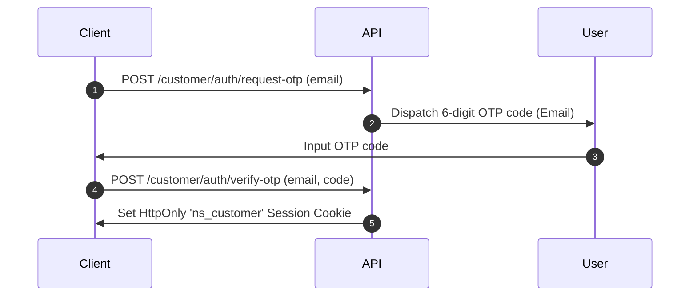

## Authentication Architecture

NordStern secures all endpoints using scoped authorization boundaries. The platform manages three separate **Identity Realms**, each isolated at the cookie and session layer to prevent privilege escalation.

---

## 1. Developer API Key Authentication

To interact with the Anchor APIs programmatically, requests must include a secret API key generated from your Operator Console.

* **Header Name:** `Authorization`
* **Format:** `Bearer <your_secret_key>`
* **Key Scoping:** All API keys are scoped strictly to the anchor workspace that created them. A key generated for Workspace A will return `401 Unauthorized` if queried against Workspace B.

### Example Request

```bash
curl -H "Authorization: Bearer ns_sk_prod_abc123" \
     -H "Content-Type: application/json" \
     https://api.nordstern.live/api/v1/applications
```

---

## 2. Customer Authentication Flow

End-user (customer) endpoints (under `/api/v1/customer/*`) are secured using a passwordless, one-time passcode (OTP) flow:



### Request OTP Code
* **Endpoint:** `POST /api/v1/customer/auth/request-otp`
* **Request Body:**
  ```json
  {
    "email": "customer@example.com"
  }
  ```
* **Response:** `200 OK` (Always returns 200 to prevent email enumeration).

### Verify OTP Code
* **Endpoint:** `POST /api/v1/customer/auth/verify-otp`
* **Request Body:**
  ```json
  {
    "email": "customer@example.com",
    "code": "123456"
  }
  ```
* **Response:**
  * **Headers:** Sets `Set-Cookie: ns_customer=<token>; HttpOnly; Secure; SameSite=Lax`
  * **Body:**
    ```json
    {
      "status": "success",
      "user": {
        "id": "cust_9876",
        "email": "customer@example.com"
      }
    }
    ```

---

## 3. Session Security Policies

All browser session cookies (`ns_session`, `ns_customer`, `ns_admin`) are locked down using standard browser security constraints:
* **HttpOnly:** Prevents client-side scripts from reading the session tokens, neutralizing Cross-Site Scripting (XSS) exposures.
* **Secure:** Enforced for all non-local connections, ensuring cookies are transmitted only over encrypted TLS (HTTPS) channels.
* **SameSite=Lax:** Restricts cookie sharing on cross-origin requests, protecting against Cross-Site Request Forgery (CSRF).
* **Host-Only Bind:** Domain scope is restricted to the specific subdomain that issued it. An authenticated customer session on `mizupay.nordstern.live` cannot be read by `zen.nordstern.live`.

---

## Related Pages
* **[Developer Overview](/developers/overview)**
* **[API Reference](/reference/api-reference)**
* **[Transaction Statuses](/reference/transaction-statuses)**
