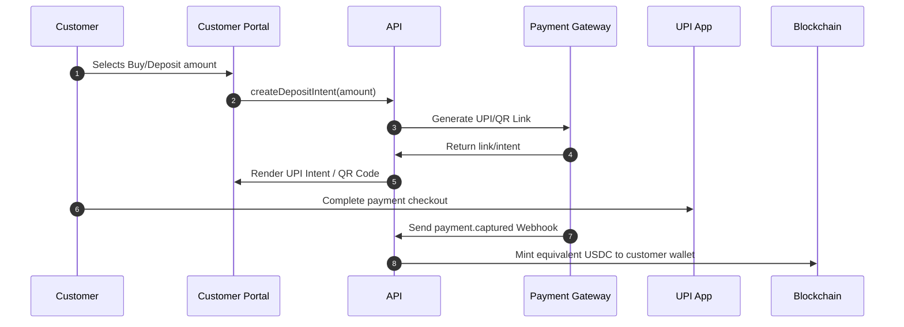

## Overview

NordStern supports automated fiat collection and payouts in India. The payment architecture isolates payment gateways behind modular adapters, allowing you to easily configure or swap payment providers (e.g. Razorpay or Cashfree).

---

## 1. Customer Deposit Flow (Fiat-In)

When a customer initiates a deposit in their wallet app, the client opens your interactive web view:

* **Desktop Flow:** Renders a dynamic, transaction-specific **UPI QR Code** that the user scans with their phone.
* **Mobile Flow:** Triggers a native **UPI Intent URL** (`upi://pay?...`) that prompts the user to select their local UPI app (e.g. GPay, PhonePe, Paytm).
* **Payment Webhooks:** Once payment succeeds, the gateway triggers a webhook to your business server. After validating the signature, the server releases the digital assets to the customer's wallet.

---

## 2. Customer Withdrawal Flow (Fiat-Out)

When a customer initiates a withdrawal (off-ramp) from their wallet app:

1. **Token Detection:** The customer sends digital assets from their wallet back to your anchor's treasury account.
2. **On-Chain Event:** The NordStern Observer detects the transaction on-chain and parses the unique transaction memo.
3. **Automated Payout:** The business server maps the memo to the customer's pre-verified bank details and calls the payout adapter (`PayoutProvider`).
4. **Bank Transfer:** The adapter triggers an instant **IMPS** or **UPI** disbursement to the customer's bank account.

---

## 3. Go-Live Production Safety Checklist

Before enabling live money movement, complete these checks to ensure safety and prevent capital leaks:

1. **Verify Webhook Signatures:** Ensure that incoming webhook handlers enforce signature verification (using HMAC/SHA256 headers). This prevents attackers from sending fake payment success payloads.
2. **Whitelisting:** Configure IP whitelisting on your payment gateway dashboard to accept webhook requests only from verified IP ranges.
3. **Double-Spend Protection:** Ensure that the database reconciler is active. The system must track transaction states (`PROCESSING` -> `COMPLETED`) to prevent double-minting or double-payouts on duplicate webhook deliveries.
4. **Volume Ceilings:** Set low daily velocity limits on the gateway during the initial launch phase to blunting potential operational errors.

---

## Related Pages
* **[Swappable Adapters](/developers/adapters)**
* **[Developer Authentication](/developers/authentication)**
* **[Operator Console Dashboard](/operator/dashboard)**
