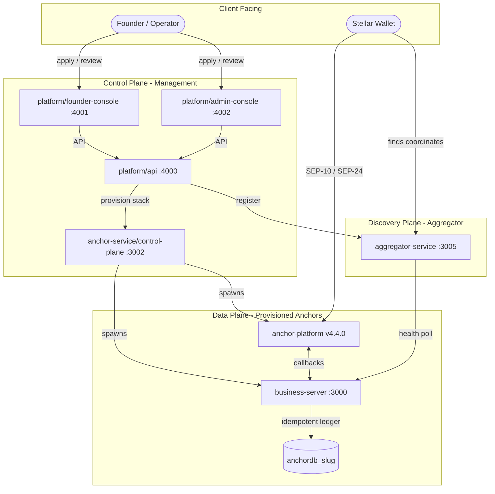

NordStern is designed around a three-plane model that separates administration, transaction execution, and anchor discoverability.

---

## The Three Planes

1. **Control Plane:** Handles onboarding, approvals, provisioning, and orchestration. It is responsible for generating Stellar keys, issuing assets, standing up dedicated containers, and configuring databases.
2. **Data Plane:** Consists of the active, running containers for each tenant anchor. It executes the core SEP flows, handles deposits and withdrawals, communicates with local banking APIs, and reads/writes the blockchain.
3. **Discovery Plane (Aggregator):** A registry that tracks the health, liquidity, fees, and uptime of all provisioned anchors. It acts as a routing matchmaker, directing wallet requests to the most optimal anchor.

---

## The 8 Services

The platform consists of the following eight primary services:

| Service | Location | Port | Role | Technology |
|---|---|---|---|---|
| **Platform API** | `platform/api` | `4000` | User management, auth, application queue, triggers provisioning. | Express, Drizzle, PostgreSQL |
| **Founder Console** | `platform/founder-console` | `4001` (dev) | The dashboard where founders register, view state, and check credentials. | Next.js, React 19, Tailwind CSS |
| **Admin Console** | `platform/admin-console` | `4002` (dev) | The super-admin panel where staff reviews and approves applications. | Next.js, React 19, Tailwind CSS |
| **Control Plane** | `anchor-service/control-plane` | `3002` | Provisioning engine. Performs on-chain key setup and launches containers. | Express, Dockerode, Stellar SDK |
| **Aggregator** | `anchor-template/aggregator-service` | `3005` | Registry, routing engine, quote calculator, health monitor. | Express, pg, Postgres |
| **Anchor Platform** | Docker (`stellar/anchor-platform`) | `8080` (public) `8085` (private) | Official Stellar SEP server. Processes protocol handshakes and ledger observers. | Java / Kotlin (Upstream) |
| **Business Server** | `anchor-template/business-server` | `3000` | Processes anchor money-movement, KYC updates, outbox reconciliation. | Express, Node-pg, Stellar SDK |
| **Database** | Docker (`postgres:15`) | `5432` | Host for the 4 platform databases and tenant databases. | PostgreSQL |

---

## Communication Boundaries

To guarantee security and non-custodial status, **no customer transactions flow through the Control Plane or Aggregator**. 
All deposits, KYC, and withdrawals occur directly between the customer's wallet, the provisioned **Anchor Platform** / **Business Server**, and the external financial rails (Razorpay / Cashfree). The Aggregator only handles routing metadata and quotes.
