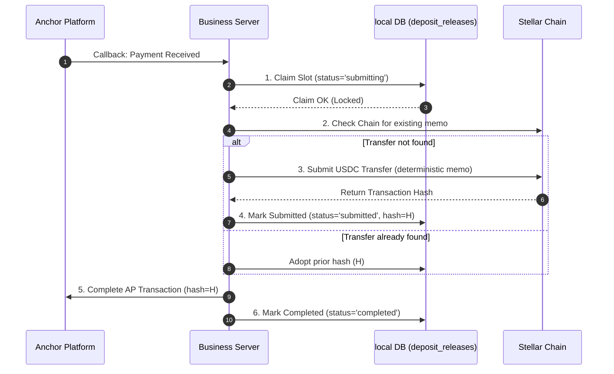

import { Callout } from 'fumadocs-ui/components/callout';

The **Business Server** (`anchor-template/business-server`) is the transaction execution brain of each individual anchor. It responds to Anchor Platform callbacks, renders the interactive SEP-24 interfaces, and drives the payments outbox.

---

## The Deposit Outbox: Transfer-After-Commit (DEC-007)

When a customer pays fiat (e.g. INR via Razorpay), the anchor must release the stable asset (e.g. USDC) on-chain. Doing this naively (sending the Stellar transaction, then updating the database) creates a window for double-spends if the server crashes mid-flight.

To resolve this, the Business Server implements a **Transfer-After-Commit outbox pattern**:



### The Reconciler
A background worker runs every 30 seconds to reconcile stuck deposit releases:
1. It queries `nordstern.deposit_releases` for rows in non-terminal states (`submitting`, `submitted`, `failed`) that are older than 25 seconds (longer than a Stellar ledger close window).
2. It checks the Stellar ledger. If the payment landed on-chain, it completes the AP transaction and marks the row `completed`.
3. If the payment did not land on-chain and attempts `< 5`, it safely re-drives the transfer.

---

## The Payout Guard: At-Most-Once Payouts (DEC-009)

When a user initiates an off-ramp withdrawal, they send USDC on-chain. The Anchor Platform Observer detects this and moves the transaction to `pending_anchor`. The Business Server must then disburse fiat (INR) to the user's bank account.

The Stellar Anchor Platform (v4.4.0) has a known limitation: **its transaction status queries are unreliable and may return stale states**. Relying on the AP status to verify if a payout has run is insecure.

The Business Server solves this with an **At-Most-Once Payout Guard**:

```
[Poller finds pending_anchor]
              │
              ▼
    ┌───────────────────┐
    │ Claim Payout Slot │ ──► INSERT INTO withdrawal_payouts (status='processing')
    └───────────────────┘
              │
      ┌───────┴───────┐
      ▼               ▼
[Conflict - status='completed']   [Success - claimed]
      │               │
      │               ▼
      │     ┌───────────────────┐
      │     │ Disburse Fiat INR │ ──► PayoutProvider.disburse()
      │     └───────────────────┘
      │               │
      │               ▼
      │     ┌───────────────────┐
      │     │ Mark Payout Paid  │ ──► Update status='completed', reference=UTR
      │     └───────────────────┘
      │               │
      ▼               ▼
┌───────────────────────────────────────────────┐
│     Idempotently Complete AP Transaction      │
└───────────────────────────────────────────────┘
```

1. **Atomic Payout Claim:** Before making any external payout calls, the poller inserts a row into `nordstern.withdrawal_payouts`.
2. **Conflict Handling:** If the transaction ID already exists in `completed` state, the poller skips the payment and directly finishes the AP transaction (self-healing from a previous crash).
3. **Execution:** If claimed, the poller triggers the payout provider. It saves the returned UTR reference and completes the AP transaction.

---

<Callout type="warn" title="Single Tenant Codebase Mismatch">
  The multi-tenant provisioning system currently launches the older `anchor-service/business-server` (the ANCH mint asset stack) rather than the money-safe `anchor-template/business-server` image. 
  
  Unifying the factory to launch the `anchor-template` codebase (porting the outbox, at-most-once guards, and Razorpay adapters) is a critical Phase 1 roadmap task.
</Callout>

---

## Traceability Links

* Release outbox manager: [`anchor-template/business-server/src/releases.ts`](file:///Users/manobendramandal/Desktop/code/nordstern/anchor-template/business-server/src/releases.ts)
* Withdrawal poller logic: [`anchor-template/business-server/src/poller.ts`](file:///Users/manobendramandal/Desktop/code/nordstern/anchor-template/business-server/src/poller.ts)
* Platform APIs router: [`anchor-template/business-server/src/platform.ts`](file:///Users/manobendramandal/Desktop/code/nordstern/anchor-template/business-server/src/platform.ts)
