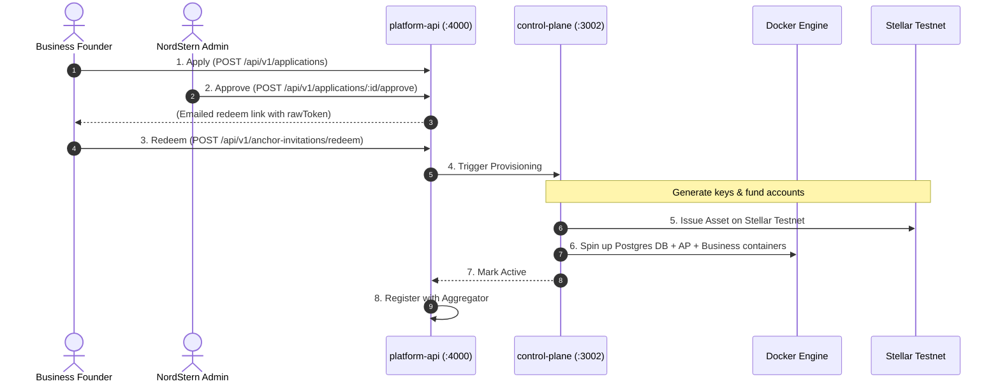

import { Callout } from 'fumadocs-ui/components/callout';

This guide walks you through the life cycle of onboarding a new anchor tenant, Acme Pay, from application to live provisioning on the local stack.



---

## Step 1: Submit a Business Application

A founder applies by providing their company details, payment rail credentials, compliance profile, and target Stellar asset. This creates an application in `platformdb` with status `applied`.

**Action (using `curl`):**
```bash
curl -sX POST localhost:4000/api/v1/applications \
  -H 'content-type: application/json' \
  -d '{
    "companyProfile": {
      "name": "Acme Pay",
      "businessEmail": "onboarding@acme.test"
    },
    "stellarConfig": {},
    "paymentRails": {},
    "compliance": {}
  }'
```
*Note the returned `"id"` (Application ID) from the response JSON.*

---

## Step 2: Admin Authentication & Approval

A NordStern super-admin logs into the central dashboard and approves the application. This generates a cryptographically secure, single-use invitation token.

1. **Admin Login** (issues an `ns_admin` cookie):
   ```bash
   curl -s -c cookies.txt -X POST localhost:4000/api/v1/auth/login \
     -H 'content-type: application/json' \
     -d '{"email": "admin@nordstern.test", "password": "Passw0rd!2345"}'
   ```
   *(Note: For local dev, admin credentials default to those defined in `docker-compose.platform.yml` env)*

2. **Approve Application** (targets the ID from Step 1):
   ```bash
   curl -s -b cookies.txt -X POST localhost:4000/api/v1/applications/<APPLICATION_ID>/approve
   ```
   *Look for the `"rawToken"` in the response. This is the single-use invite.*

---

## Step 3: Redeem Invitation

The founder receives their invite and redeems it. This step creates the user, the organization, the anchor draft, and kicks off a background **provisioning job**.

**Action:**
```bash
curl -sX POST localhost:4000/api/v1/anchor-invitations/redeem \
  -H 'content-type: application/json' \
  -d '{
    "token": "<RAW_TOKEN>",
    "subdomain": "acmepay",
    "fullName": "Acme Owner",
    "password": "Passw0rd!2345"
  }'
```
*Look for the `"jobId"` in the response to trace the status.*

---

## Step 4: Monitor Provisioning Stage

The platform API triggers the `control-plane` to execute `runProvision`. We can query the status of the job in real-time.

**Action:**
```bash
curl -s localhost:4000/api/v1/anchor-invitations/status/<JOB_ID>
```

As the job runs, you will see its `result.stage` transition through the following real steps:
1. `"Generating Stellar keys"`
2. `"Funding accounts & issuing asset on Stellar"` (funds issuer/distributor via Friendbot, builds asset trustline)
3. `"Generating configuration files"`
4. `"Setting up databases"`
5. `"Spawning containers"` (launches AP and business-server container stack)
6. `"Waiting for stack to be healthy"`
7. `"completed"`

---

## Step 5: Verify Live Endpoints

Once the job is completed, the platform-api registers the anchor with the aggregator. You can verify it is live:

1. **Query the Aggregator Registry:**
   ```bash
   curl -s localhost:3005/anchors
   ```
   *The new anchor `acmepay` should be listed with `current_availability: true`.*

2. **Test the SEP-1/SEP-10 Endpoints (via Traefik on port 80):**
   ```bash
   # Query the TOML service discovery file
   curl -s -H "Host: acmepay.anchors.localhost" http://localhost/.well-known/stellar.toml

   # Request an authentication challenge (SEP-10)
   curl -s -H "Host: acmepay.anchors.localhost" "http://localhost/auth?account=GD3...[YOUR_WALLET_PUBLIC_KEY]"
   ```
   *You should receive a valid, cryptographically signable transaction envelope (XDR).*
