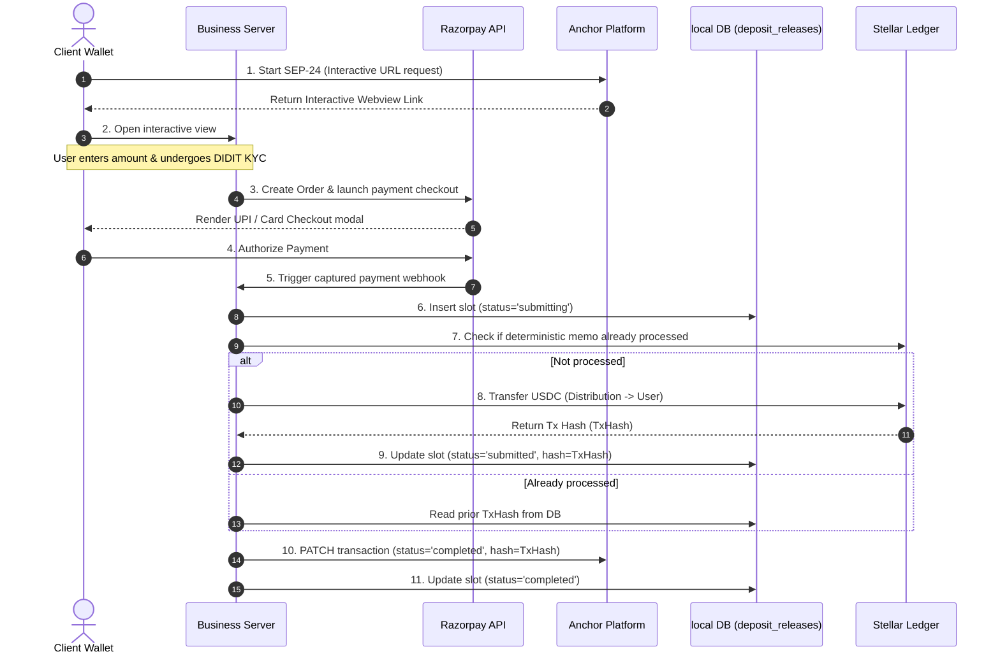

This section provides detailed transaction flows and sequence traces for deposit (on-ramp) and withdrawal (off-ramp) operations.

---

## On-Ramp Sequence (Buy Flow)

The on-ramp flow takes fiat INR from a customer's bank account (via Razorpay) and delivers digital tokens (e.g. USDC) to their Stellar wallet.



### Critical Steps in On-Ramp:
* **Step 5 (Webhook):** Razorpay captures the payment and notifies the business server. The money is now inside the anchor's corporate account.
* **Step 6 (Outbox Lock):** The business server creates a lock in `deposit_releases` to prevent concurrent webhooks from processing the same order.
* **Step 7 (Deduplication lookup):** The server scans Stellar history using a hash of the transaction ID as the memo. If found, it skips the blockchain call to avoid sending money twice.
* **Step 10 (AP Update):** The platform status changes to `completed`, updating the wallet interface.

---

## Off-Ramp Sequence (Sell Flow)

The off-ramp flow receives digital tokens from a user's wallet and pays out INR to their bank account (via Cashfree).

```mermaid
sequenceDiagram
  autonumber
  actor Wallet as Client Wallet
  participant AP as Anchor Platform
  participant Obs as Horizon Observer
  participant BIZ as Business Server
  participant DB as local DB (withdrawal_payouts)
  participant CF as Cashfree API

  Wallet->>AP: 1. Request withdrawal (SEP-24)
  AP-->>Wallet: Return Webview (payout bank account form)
  Wallet->>AP: 2. Send USDC to Anchor Distribution Address
  Obs->>AP: 3. Detect ledger transfer (Match by memo)
  AP->>AP: 4. Transition tx state to 'pending_anchor'
  BIZ->>AP: 5. Poller lists 'pending_anchor' txs (every 10s)
  BIZ->>DB: 6. Atomic claim (status='processing')
  alt Claim Successful
    BIZ->>CF: 7. Trigger fiat payout (disburse)
    CF-->>BIZ: Return UTR reference / success
    BIZ->>DB: 8. Mark paid (status='completed', reference=UTR)
  else Claim Fails
    Note over BIZ: Payout already processed; skip
  end
  BIZ->>AP: 9. PATCH transaction (status='completed')
```

### Critical Steps in Off-Ramp:
* **Step 3 (Observer):** The Horizon ledger watcher detects the user's USDC payment to the anchor. 
* **Step 6 (At-Most-Once Guard):** The poller claims the withdrawal ID. If it is already marked `completed` in the database, the server skips the Cashfree disburse step.
* **Step 7 (Disbursement):** The anchor calls the Cashfree Payout API, moving real fiat to the user's bank.
* **Step 9 (Complete):** The platform is patched, marking the transaction as successfully completed.

---

## Safety Guarantees

NordStern's database-level outbox and payout locks guarantee:
* **No Double-Spends:** A database insert must succeed before any money moves. If a server crashes mid-payout, the ledger lookup will identify the transaction when the server boots, ensuring a duplicate payment is never triggered.
* **Idempotent Retries:** Network timeouts will trigger retries. The outbox structure handles duplicates by adopting existing hashes rather than submitting fresh transfers.
