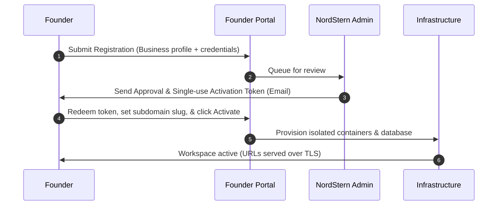

## Overview

The onboarding journey starts at the Founder Portal. As a B2B partner, this portal is your launchpad where you register your organization, submit compliance details, configure payment credentials, and trigger workspace deployments.

---

## The Onboarding Journey

### 1. Submit Registration
* **Purpose:** To request a new anchor workspace and establish corporate entity details.
* **Who it's for:** Fintech founders, product managers, or legal representatives.
* **Prerequisites:** Valid corporate registration documents, active bank relationships, and payment processor credentials.
* **Steps:**
  1. Access the Founder Portal registration wizard at `register.nordstern.live`.
  2. Input your email address to log in securely via OTP.
  3. Complete the three-step registration form:
     * **Company Profile:** Entity name, primary address, and point of contact.
     * **Product & Rails:** Select transaction currencies (defaults to INR) and input payment processor API keys (e.g. Razorpay or Cashfree).
     * **Compliance Profiling:** Submit anti-money laundering (AML) and risk policies.
  4. Submit your application.

---

### 2. Approval Queue
Once submitted, your application is queued for administrative review. NordStern verifies the entity registration and compliance profiles. 
* **Timeline:** Standard reviews are completed in 1 to 2 business days.
* **Outcome:** On approval, an email is dispatched containing a unique, single-use activation token.

---

### 3. Redeem & Activate Workspace
After receiving your approval email, you can provision your live workspace.
* **Steps:**
  1. Click the secure redeem link in your approval email (valid for 7 days).
  2. Choose a **subdomain slug** (e.g. `yourcompany` resulting in `yourcompany.nordstern.live`).
  3. Input your desired brand name, operational logo, and color theme.
  4. Click **Redeem**.
* **Expected Outcome:** The system triggers the automated provisioning backend. This generates your workspace keypairs, provisions an isolated database instance, and boots up your dedicated anchor servers.
* **Provisioning Time:** Provisioning takes approximately **3 to 5 minutes**. A status indicator in the portal displays stages in real-time.

---

### 4. Workspace Activation
Once provisioning succeeds, you are provided with your active workspace endpoints:
* **Customer Portal URL:** `https://<slug>.nordstern.live`
* **Operator Console URL:** `https://console-<slug>.nordstern.live`
* **API Metadata endpoint:** `https://api.nordstern.live`

---

## Go-Live Checklist
Before directing users to your customer portal, complete these checklist steps in your workspace:

1. **Verify Public Metadata:** Query your public service discovery file at `https://<slug>.nordstern.live/.well-known/stellar.toml` to ensure the asset codes and fee rates match your target parameters.
2. **Fund Treasury Reserves:** Transfer test tokens (or USDC on Mainnet) to your workspace distribution address to provide transaction liquidity.
3. **Configure API Keys:** Access your Operator Console, generate secret API keys for your developer team, and configure your payment gateway webhook routes.
4. **Run a Test Transaction:** Execute a sandbox deposit and withdrawal to verify bank settlement connectivity.

---

## Related Pages
* **[How it Works](/getting-started/concepts)**
* **[Operator Dashboard Guide](/operator/dashboard)**
* **[API Integration Overview](/developers/overview)**
