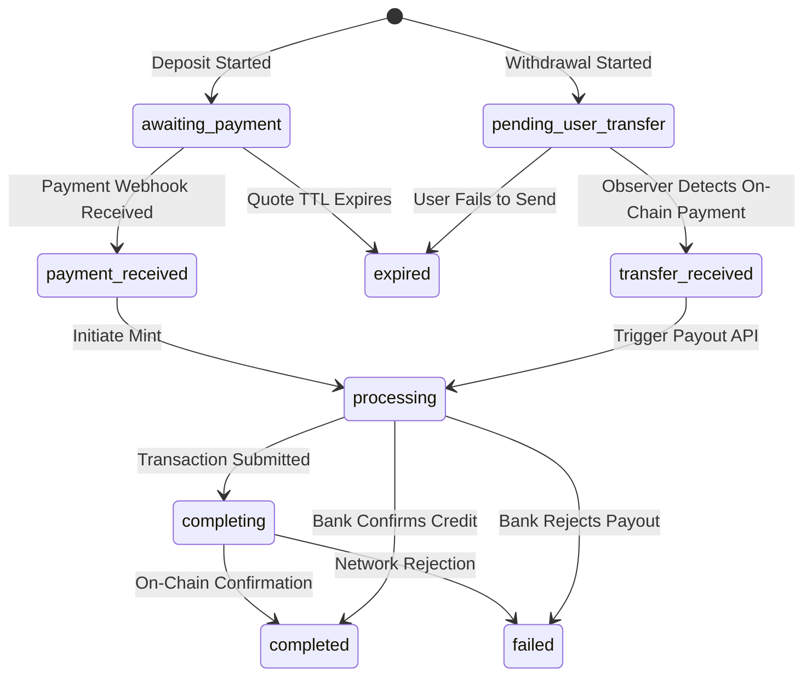

## Transaction Lifecycle States

Transactions on the NordStern platform transition through a series of status states as funds clear in the banking rails and on-chain. Understanding these states helps developers track API events and helps operator staff monitor payments.

---

## 1. Customer Deposit Flow (On-Ramp)

The table below maps the transaction status states for a customer deposit (INR to digital assets):

| API Status | Dashboard Label | What it means | Next Transition |
|---|---|---|---|
| `awaiting_payment` | Awaiting Payment | The customer has created a deposit transaction, and the UPI QR code or intent has been generated. The system is waiting for checkout payment. | `payment_received` or `expired` |
| `payment_received` | Payment Captured | The payment gateway has confirmed capture of the INR funds from the customer's bank. | `processing` |
| `processing` | Minting Asset | The anchor business server is preparing and signing the transaction to send the digital asset (e.g. USDC) to the user's wallet. | `completing` |
| `completing` | Confirming On-Chain | The transaction has been submitted to the blockchain network and is waiting for ledger consensus validation. | `completed` or `failed` |
| `completed` | Completed | The transaction succeeded. The digital asset is cleared in the customer's wallet address. | *Terminal State* |
| `failed` | Failed | The transaction failed (e.g., payment was declined by the bank or the blockchain transaction failed). | *Terminal State* |
| `expired` | Expired | The customer did not complete payment before the transaction quote time-to-live (TTL) expired. | *Terminal State* |

---

## 2. Customer Withdrawal Flow (Off-Ramp)

The table below maps the transaction status states for a customer withdrawal (digital assets to INR):

| API Status | Dashboard Label | What it means | Next Transition |
|---|---|---|---|
| `pending_user_transfer` | Awaiting Asset | The customer has initiated a withdrawal. The system is waiting for them to submit the digital asset transfer from their wallet with the correct memo. | `transfer_received` or `expired` |
| `transfer_received` | Asset Received | The blockchain network has confirmed that the user sent the digital assets to the anchor's treasury account. | `processing` |
| `processing` | Processing Payout | The system has detected the assets and is calling the payout gateway to trigger a bank transfer (IMPS/UPI) to the user's bank account. | `completed` or `failed` |
| `completed` | Completed | The payout gateway has confirmed successful credit of INR funds in the customer's bank account. | *Terminal State* |
| `failed` | Failed | The payout failed (e.g., wrong bank details or invalid IFSC code). The operator must manually review and retry or refund. | *Terminal State* |

---

## 3. Transaction State Transitions

---

## Related Pages
* **[Operator Console Dashboard](/operator/dashboard)**
* **[Developer Overview](/developers/overview)**
* **[API Reference](/reference/api-reference)**
