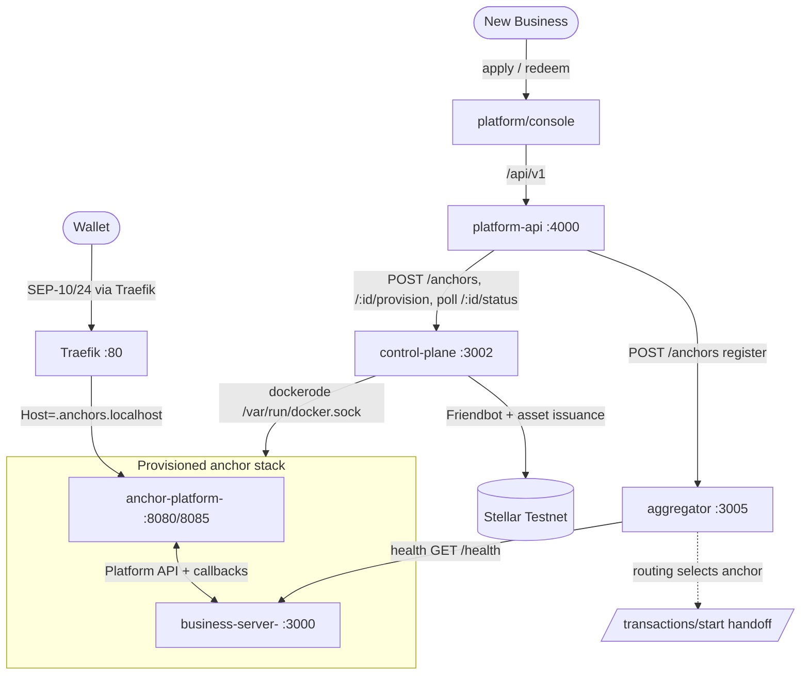
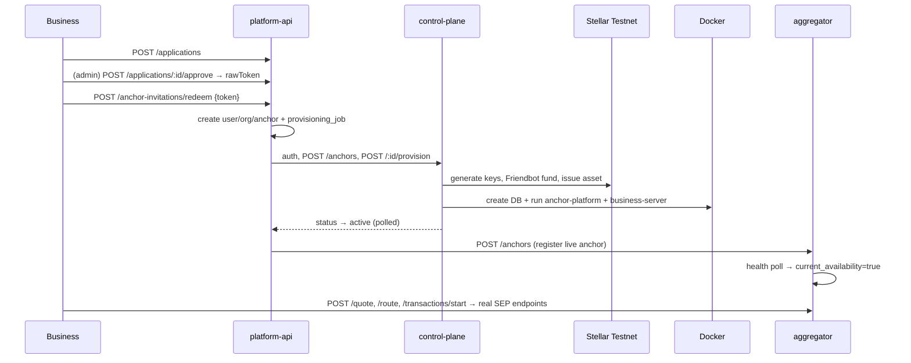

# NordStern — Current State (canonical snapshot)

> **Purpose.** A senior engineer joining six months from now should understand the
> entire platform from this file alone. Everything here is **based on the actual
> implementation** (code read + a full end-to-end run personally executed on
> 2026-07-06), not on aspirational architecture docs. Where code and older docs
> disagree, this file follows the code.
>
> **Status legend:** ✅ Implemented · ⚠️ Partially Implemented · 📋 Planned/Blueprint · ❌ Not Implemented
>
> **Verification basis:** the connected platform was brought up via
> `docker-compose.platform.yml` and driven through apply → approve → redeem → real
> provisioning → aggregator registration → routing → live SEP-10/24 endpoints. Those
> claims are marked **[verified live]**.

---

# Executive Summary

**What NordStern is.** B2B infrastructure that lets a business become a compliant
**Stellar anchor** (fiat ⇄ Stellar on/off-ramp) without building the SEP protocol
servers, KYC, payment rails, treasury, and ops stack itself. Positioning: **"Vercel
for Stellar Anchors."** NordStern is **not** an anchor, exchange, or wallet.

**Problem it solves.** Standing up a real anchor means running SEP-1/10/12/24/38
servers, integrating KYC (Aadhaar/PAN), payment rails (UPI/collections/payouts),
treasury/FX, and compliance workflows — expensive and repetitive per anchor.
NordStern runs and manages that stack per anchor and (aspirationally) aggregates all
anchors into one routable network.

**Vision (three planes).**
- **Control plane** — provision & manage anchors (the factory).
- **Data plane** — each anchor's running stack.
- **Discovery plane** — all anchors: health, capabilities, fees → routing/matching.

**Current implementation status.** The platform is now **genuinely connected
end-to-end** (as of the 2026-07-06 integration work): a brand-new business can apply,
be approved, redeem an invite, and the platform **automatically drives the real
Docker/Stellar provisioner**, which issues a real testnet asset and launches real
containers; the aggregator **auto-registers** the anchor; the routing engine selects
it; and the handoff returns the anchor's **live SEP-24 endpoints**. Previously this
was simulated (`setTimeout` theatre) — that is gone.

**Current maturity: Alpha (connected, runnable, not yet self-serve product).** The
hard money-path of a single anchor (`anchor-template`) is **Beta/Production-Candidate
for the on-ramp**; the platform wiring is **Alpha**; infra (K8s) is **Blueprint**.

---

# Repository Overview

One git repo (`github.com/Kaushik2003/nordstern`), several independent subprojects,
no top-level build. **Two things routinely confuse newcomers**, so read this first:

1. There are **two anchor codebases**: `anchor-service/` (the older ANCH-mint factory,
   which contains the **real provisioner**) and `anchor-template/` (the newer,
   money-safe **USDC** single anchor). The platform provisioner currently launches the
   **`anchor-service`** stack.
2. There are **multiple frontends** with different roles (landing, platform console,
   operator dashboards, synthetic demo console).

```
nordstern/
├─ platform/                 # The SaaS control-plane the business interacts with
│  ├─ api/                   # ✅ platform-api (Express + Drizzle + Postgres) :4000
│  │                         #   auth, orgs, applications, invitations, provisioning jobs
│  │                         #   → drives the REAL provisioner + aggregator registration
│  └─ console/               # ⚠️ Next.js onboarding UI (register wizard, auth, redeem)
│
├─ anchor-service/           # ★ THE REAL PROVISIONER lives here (older ANCH factory)
│  ├─ control-plane/         # ✅ Express :3002 — dockerode orchestrator, keygen,
│  │                         #   Friendbot, asset issuance, config-gen, health, vault
│  ├─ business-server/       # ✅ the anchor runtime image the provisioner launches
│  │                         #   (nordstern/business-server:dev)
│  ├─ client/                # ⚠️ per-anchor wallet/dashboard (nordstern/anchor-client:dev)
│  └─ config/                # AP config templates (anchor-platform.yaml, assets.yaml)
│
├─ anchor-template/          # ★ THE MONEY-SAFE USDC ANCHOR (single-tenant, most code)
│  ├─ business-server/       # ✅ SEP-24 on-ramp, idempotency outbox, DIDIT KYC,
│  │                         #   Razorpay collection, withdrawal payout guard
│  ├─ client/                # ⚠️ operator console (Next.js, live /admin data)
│  ├─ aggregator-service/    # ✅ the Aggregator (routing/quote/registry/health) :3005
│  ├─ config/                # AP config (stellar.toml, assets.yaml)
│  ├─ infra/                 # 📋 Phase-1 cloud infra (Terraform/Helm/ArgoCD/Dockerfiles)
│  ├─ scripts/               # setup-testnet, fund-treasury, test-* smoke scripts
│  └─ docs/                  # DECISIONS (DL/DEC/AT), KNOWN_ISSUES, GO_LIVE_GATING, ...
│
├─ frontend/                 # Brand system + landing + "Keel" synthetic demo console
│  ├─ landing/               # ⚠️ marketing site (Next.js)
│  └─ web/                   # 🎭 "Keel" operator console PROTOTYPE (faker synthetic data)
│
├─ anchor-platform/          # 📋 Upstream Stellar AP source clone — REFERENCE ONLY
├─ sep24-reference-ui/       # 📋 Stellar's SEP-24 reference wallet — REFERENCE ONLY
├─ docs/                     # Stellar reference docs + docs/project/ (authored context)
├─ deploy/                   # ✅ pg-init.sql + README for the unified stack
└─ docker-compose.platform.yml   # ✅ THE unified run (platform + control-plane + aggregator)
```

**Relationships.** `platform/api` → (HTTP) → `anchor-service/control-plane` → (dockerode)
→ per-anchor `anchor-platform` + `business-server` containers → (HTTP register) →
`aggregator-service`. `frontend/landing` markets it; `platform/console` is the business
UI; `frontend/web` is a synthetic demo not wired to any backend.

---

# Overall Architecture

## Components & responsibilities

| Component | Path | Port | Responsibility | Status |
|---|---|---|---|---|
| Landing website | `frontend/landing` | (static) | Marketing / lead-in | ⚠️ |
| Platform console | `platform/console` | 3000 (dev) | Register wizard, auth, redeem UI | ⚠️ |
| **Platform API** | `platform/api` | 4000 | Onboarding: auth, orgs, applications, invitations, **drives provisioning** | ✅ |
| **Control Plane** | `anchor-service/control-plane` | 3002 | **Real provisioner**: keygen, Friendbot, asset issuance, config-gen, dockerode, health, vault | ✅ |
| Docker Orchestrator | `.../control-plane/orchestrator.ts` | — | dockerode: create DB, run AP+biz(+client+console), Traefik labels, health | ✅ (AP+biz verified) |
| **Aggregator** | `anchor-template/aggregator-service` | 3005 | Registry, quote, routing, health workers, SEP handoff | ✅ |
| Anchor Runtime (AP) | `stellar/anchor-platform:latest` | 8080/8085 | SEP-1/10/12/24/38 protocol server + Observer | ✅ |
| Business Server (ANCH) | `anchor-service/business-server` | 3000 | Callbacks, SEP-24 interactive, Stellar ops (per-anchor asset) | ✅ |
| Business Server (USDC) | `anchor-template/business-server` | 3000 | Money-safe USDC on-ramp, idempotency, real KYC/PSP | ✅ (single-tenant) |
| Operator Dashboard | `anchor-service/client`, `anchor-template/client` | 3001 | Per-anchor treasury/tx console | ⚠️ |
| Customer Frontend | (none dedicated) | — | End-user ramp UI | ❌ |
| Infrastructure | `anchor-template/infra` | — | Terraform/Helm/ArgoCD for EKS | 📋 |

## Communication (verified live)



Thin lines = control/metadata; the **money path is wallet ⇄ anchor ⇄ Stellar**, never
through platform-api or the aggregator (deliberate — keeps NordStern non-custodial).

---

# Business Onboarding Flow

**[verified live]** — a new business (`Acme Pay`) was driven through the whole chain.

```
Business ── POST /api/v1/applications ─────────────► application (status: applied)
   │
Admin ───── POST /applications/:id/approve ────────► rawToken (invitation) [needs auth cookie]
   │
Invitee ─── POST /anchor-invitations/redeem ───────► user + org + projects + anchor(draft)
   │                                                 + provisioning_job(pending) → triggers worker
   │
Platform worker ─ provisionerService.start() ──────► control-plane POST /anchors + /:id/provision
   │                                                 (real dockerode lifecycle begins)
   │
Poll ────── GET /anchor-invitations/status/:jobId ─► running → "Funding accounts & issuing asset
   │                                                 on Stellar" → "Waiting for stack healthy" → completed
   │
Provisioning done ─ registerWithAggregator() ──────► aggregator POST /anchors (real endpoint+asset)
   │
Aggregator ─ health worker marks available ────────► GET /anchors returns it, current_availability=true
   │
Anchor Live ─ SEP-1/10/24 served via Traefik ──────► wallet can begin SEP-10 → SEP-24 on-ramp
```



---

# Provisioning System

**Source of truth:** `anchor-service/control-plane/src/provision.ts` (`runProvision`)
+ `orchestrator.ts`. Actual execution path (each step **real**, verified live):

1. **Keypair generation** — `generateKeypairs()` (signing, distribution, issuer). Secrets
   AES-encrypted (`encryptSecret`, `MASTER_KEK`) into `anchor_secrets` (public keys in clear).
2. **Asset code** — `assetCodeFromSlug(slug)` (e.g. `ACMEOWNERSOR`; per-anchor, ≤12 chars).
3. **Friendbot funding + on-chain asset issuance** — `provisionAssetOnChain(kps, assetCode)`
   funds accounts on testnet and establishes the asset (issuer → distribution trustline/payment).
   Status string: *"Funding accounts & issuing asset on Stellar"*.
4. **Config generation** — `generateAnchorConfig(...)` writes per-anchor AP config
   (`stellar.toml`, `anchor-platform.yaml`, `assets.yaml`) into `ANCHOR_CONFIG_HOST_ROOT/<slug>`.
5. **Database creation** — `createAnchorDb(slug)` → `anchordb_<slug>` (per-anchor AP DB).
6. **Container stack** — `createAnchorStack(...)` via **dockerode**:
   - `anchor-platform-<slug>` (image `stellar/anchor-platform:latest`, ports 8080/8085)
   - `business-server-<slug>` (image `nordstern/business-server:dev`, 3000)
   - **also coded:** `anchor-client-<slug>` + `operator-console-<slug>` — ⚠️ **but
     `provision.ts` only persists `apId`+`bizId`; the verified E2E observed only AP+biz
     running.** Client/console launch is coded, images exist, but is **unverified/untracked**.
   - Traefik labels: `Host(<slug>.anchors.localhost)` → AP:8080 (priority 5),
     `api.<...>` → biz:3000, `console.<...>` → console:3001.
7. **Health verification** — `waitHealthy(slug)` polls AP `stellar.toml` + biz `/health`.
8. **Status → active** — `tenants.stack_status='active'`; container ids stored.
9. **Aggregator registration** — done by **platform-api** (`provisionerService.registerWithAggregator`)
   after status active, using the real `home_domain`, `asset_code`, `asset_issuer`, and a
   container-reachable `api_url` (`http://business-server-<slug>:3000`).

**Failure handling:** on error, status→`error`, `removeStack` + `dropAnchorDb` cleanup.
**Retry:** `POST /anchor-invitations/status/:jobId/retry` (platform) re-drives the job.

---

# Aggregator

**Path:** `anchor-template/aggregator-service/` (Express :3005, Postgres schema `aggregator`).

- **Registry** (`aggregator.anchors`) — `POST /anchors` upserts; `GET /anchors` lists.
  Columns: id, name, domain, api_url, status, regions, capabilities(jsonb), limits,
  fee_config, treasury_capacity, current_availability. ⚠️ **Seeds two demo anchors on
  first init** (`globex`, `acme`) in `db.ts` — they show `available=false` (fake domains).
- **Quote Engine** (`quote.ts`) — `POST /quote` → routes, computes fees (`fixed + amount*percent`),
  FX via **`FX_RATE_INR_USDC` constant (⚠️ hardcoded, default 88.50)**, TTL (`QUOTE_TTL_SECONDS`),
  persists to `aggregator.quotes`. `GET /quote/:id` fetches.
- **Routing Engine** (`routing.ts`) — real weighted scoring:
  1. Load active policy weights (`routing_policies`, default fee .4/speed .2/uptime .2/liquidity .2).
  2. Filter eligible: `status=active AND current_availability=true`, supportsAsset, supportsRail,
     supportsRegion, `treasury_capacity ≥ amount`.
  3. Score each: **fee** (relative to cheapest), **speed** (instant=100/60m=50), **uptime**
     (from `health_metrics` last 1h), **liquidity** (`capacity/(amount*5)`), weighted sum.
  4. Sort desc, return best with a human-readable `reasoning`.
- **Health Monitoring** (`health.ts` + `workers.ts`) — every `HEALTH_CHECK_INTERVAL_MS`
  (15s) polls each anchor: try `/admin/summary`, **fall back to `/health`** (fix applied
  during E2E — the ANCH anchor has no `/admin/summary`); updates `current_availability` +
  `treasury_capacity`; logs `health_metrics`. Quote cleanup worker every 5 min.
- **Capability discovery** — `GET /capabilities` unions `supportedAssets/Rails/Banks`
  across active anchors.
- **SEP handoff** — `POST /transactions/start` returns the anchor's **real** SEP endpoints,
  derived from the public `home_domain` (Traefik → AP SEP server), preferring the anchor's
  own `stellar.toml`. It does **not** fabricate a transaction id (SEP-10 is wallet-signed).

**Routing decision example (verified live):** amount 5000 INR / ACMEOWNERSOR / UPI →
selected `acme-owner-s-organization`, score 82 (fee 100, speed 100, uptime 11, liquidity 100).

---

# Anchor Runtime

Each provisioned anchor = **Anchor Platform container** + **business-server container**.

- **Anchor Platform** (`stellar/anchor-platform:latest`, `-s -p -o`): SEP protocol server
  (:8080), Platform API (:8085), Observer (ledger watcher). Owns transaction state in
  `anchordb_<slug>`.
- **Business Server**: answers Platform callbacks and hosts SEP-24 interactive UI.

**SEP status (verified live on the provisioned anchor via Traefik):**
| SEP | What | Status |
|---|---|---|
| SEP-1 | `stellar.toml` service discovery | ✅ 200, real SIGNING_KEY + asset |
| SEP-10 | Web auth (challenge/JWT) | ✅ issues a real signable challenge (Test SDF Network) |
| SEP-12 | KYC customer callback | ✅ (ANCH: mock; USDC template: real DIDIT, fail-closed) |
| SEP-24 | Interactive deposit/withdraw | ✅ `/sep24/info` 200; deposit endpoint enforces auth (403 w/o JWT) |
| SEP-38 | Quotes (INR↔asset) | ✅ (USDC template: live FX; ANCH: basic) |

**On the USDC `anchor-template` specifically (the money-safe anchor):**
- **Treasury** — holds real USDC float; delivers via `sendUsdc` (idempotent).
- **KYC** — real DIDIT (Aadhaar/selfie), **fail-closed** (mock forbidden on mainnet, DEC-008).
- **Transactions** — Transfer-After-Commit **outbox** + reconciler (DEC-007, no double-spend);
  **at-most-once withdrawal payout guard** (DEC-009). Both **live-verified on testnet**.
- **Audit logs** — SHA-256 **hash chain** (`admin.ts`), 16-char truncated.
- **Compliance/strategies** — adapter seams (KYC/deposit/payout/fee); Razorpay collection real.

> ⚠️ The **provisioned** anchor is the **ANCH `anchor-service`** stack (per-anchor minted
> asset), NOT the USDC `anchor-template`. The money-safety features above live in the
> template and are **not** what the factory currently launches.

---

# Customer Frontend

- **Current:** ❌ No dedicated customer ramp app. End users use third-party Stellar wallets
  (Demo Wallet, Lobstr, Vibrant, Freighter) that open the anchor's SEP-24 interactive webview.
- **How customers interact today:** wallet → SEP-10 auth → SEP-24 interactive (served by the
  anchor's business-server) → KYC/payment → asset delivered.
- **Future routing:** the aggregator's `POST /transactions/start` hands a wallet the best
  anchor's real SEP endpoints (discovery plane); a NordStern customer app / SDK would consume
  this. 📋 Not built.
- **Subdomain strategy:** each anchor gets `<slug>.anchors.localhost` (dev, Traefik) →
  `<slug>.anchors.nordstern.io` (planned prod via external-dns/ACM in `infra/`).

---

# Operator Console

Two consoles exist; **neither is provisioned-and-reachable per anchor in the verified run.**

| Concern | `platform/console` (business SaaS) | `anchor-template/client` (per-anchor) | `frontend/web` (Keel) |
|---|---|---|---|
| Role | Register/approve/redeem/onboarding | Treasury/tx ops on live `/admin` | Synthetic demo |
| Authentication | ✅ cookie JWT (access+refresh) via platform-api | ❌ none (private-ingress by design) | n/a |
| RBAC | ✅ `requireAuth`/`requireRole`, memberships | ❌ | n/a |
| Compliance | ⚠️ wizard step (CompanyProfile/Compliance) | ❌ | 🎭 mock views |
| Treasury | ❌ | ✅ live float/KPIs | 🎭 |
| API Keys | ⚠️ schema + repo exist (`apiKeys`) | ❌ | 🎭 |
| Pricing/Strategies | ❌ | ⚠️ rules pages (template) | 🎭 |
| Settings | ⚠️ | ⚠️ | 🎭 |
| Audit Logs | ✅ `audit_logs` (platform) | ✅ hash-chained (anchor) | 🎭 |
| Developer Portal | ❌ | ❌ | 🎭 |

> The `anchor-service` factory *codes* a per-anchor `operator-console-<slug>` container,
> but it was **not observed running** in the verified E2E (see Provisioning §6).

---

# Database Design

Four logical databases on **one Postgres** (`db` service), created by `deploy/pg-init.sql`.

### `platformdb` — Drizzle schema (`platform/api/src/db/schema.ts`)
| Table | Purpose | Key relations |
|---|---|---|
| users | platform accounts (bcrypt) | → memberships, sessions |
| organizations | tenant orgs | → members, projects, anchors, provisioningJobs |
| organizationSettings | per-org settings | org 1:1 |
| memberships | user↔org + role (owner/…) | user, org |
| sessions | refresh sessions | user, org |
| invitations / anchorInvitations | org invites / anchor onboarding tokens (sha256 hash) | org, application |
| projects | sandbox/production per org | org → anchors |
| **anchors** | anchor stub (draft→active…) | org, project → provisioningJobs |
| **provisioningJobs** | job status/result/error/attempts (**real status** in `result.stage`) | org, project, anchor |
| applications | wizard submission (profile/stellar/rails/compliance) | — |
| apiKeys | API keys (schema) | org, project |
| auditLogs | append-only platform audit | org, user |

### `controldb` — control-plane (`anchor-service/control-plane/src/db.ts`)
| Table | Purpose |
|---|---|
| users | operators (control-plane JWT) |
| **tenants** | the anchor record (slug, home_domain, asset_code/issuer, stack_status, status_detail, ap/biz_container_id, compliance fields) |
| anchor_secrets | **AES-256-GCM encrypted** signing/distribution/issuer secrets (+ public key) |
| anchor_adapters | per-anchor kyc/deposit/payout/fee provider selection |
| tenant_config | per-anchor config |
| reconciliation_alerts | ops alerts |

### `aggregatordb` — schema `aggregator` (`aggregator-service/src/db.ts`)
| Table | Purpose |
|---|---|
| anchors | registry (⚠️ seeds `globex`+`acme` demo rows) |
| routing_policies | weighted scoring config (active) |
| quotes | issued quotes (TTL) |
| health_metrics | per-poll availability/latency/horizon |
| routing_decisions | audit of routes chosen |
| audit_logs | aggregator events |

### `anchordb` + `anchordb_<slug>` — Anchor Platform (Flyway-managed) + the anchor's
`nordstern` schema (USDC template: `deposit_releases`, `withdrawal_payouts`,
`kyc_verifications`, `interactive_amounts`, `razorpay_*`, `audit_logs`).

**Ownership/data flow:** platform owns onboarding metadata; control-plane owns anchor
lifecycle + encrypted keys; aggregator owns the discovery/routing metadata; each anchor
owns its own transaction book. No customer funds pool anywhere in NordStern (Model A).

---

# Infrastructure

### Current local architecture (✅ verified)
- **Docker Compose:** `docker-compose.platform.yml` — `db` (Postgres 15, 4 DBs), `traefik`
  (v3.7), `control-plane`, `aggregator`, `platform-migrate` (one-shot drizzle push),
  `platform-api`. Network **`nordstern-net`** (bridge) — provisioned anchor containers join it.
- **Traefik** routes `<slug>.anchors.localhost` (and `api.`, `console.`, `sep.`) by Docker
  labels the orchestrator sets; entrypoint `web:80`.
- **Container naming:** `anchor-platform-<slug>`, `business-server-<slug>`,
  `anchor-client-<slug>`, `operator-console-<slug>`; DB `anchordb_<slug>` (dashes→underscores).
- **Volumes:** `pgdata` (Postgres), `ANCHOR_CONFIG_HOST_ROOT` bind (per-anchor configs),
  `/var/run/docker.sock` (control-plane's dockerode — privilege surface).
- **Images:** `nordstern/business-server:dev`, `nordstern/anchor-client:dev`,
  `nordstern/operator-console:dev`, `stellar/anchor-platform:latest`, plus the three
  compose-built platform images.
- **Env:** `MASTER_KEK`, `ANCHOR_CONFIG_HOST_ROOT`, `CP_JWT_SECRET` (from `.env.base`);
  platform needs `JWT_ACCESS_SECRET`/`JWT_REFRESH_SECRET`; wiring `CONTROL_PLANE_URL`,
  `AGGREGATOR_URL`, `CP_SERVICE_EMAIL/PASSWORD`.
- **DNS:** `.localhost`/`.sslip.io` in dev (resolve to 127.0.0.1); real domain via Route 53
  planned.

### Current production architecture
- ❌ Not deployed anywhere. No cloud, no TLS in the run path (Traefik `web:80` only).

### Kubernetes / GitOps plans (📋 Blueprint — `anchor-template/infra/`)
- **Terraform:** VPC (3-AZ), EKS + Karpenter, Aurora Serverless v2, ECR, IRSA, Secrets Manager.
- **Helm:** `anchor-stack` chart (AP/biz/observer/workers, Ingress/ALB, ESO, HPA, PDB, NetworkPolicy).
- **ArgoCD:** app-of-apps + addons (LB controller, cert-manager, external-dns, external-secrets,
  kube-prometheus-stack).
- **Production Dockerfiles** (`infra/docker`): business-server image built + boot-verified.
- **Never applied/validated** (`terraform`/`helm` not run; one image built).

---

# Current Features (checklist)

**Onboarding & platform**
- ✅ Business registration / application submit
- ✅ Application approval (auth-gated) → invitation token
- ✅ Invitation redemption → org/anchor/job creation
- ✅ Real provisioning **triggered automatically** on redeem
- ✅ Real provisioning **status API** (`/anchor-invitations/status/:jobId`, real stages)
- ✅ Provisioning **retry** endpoint
- ✅ Platform auth: register/login/refresh, cookie JWT, RBAC, sessions
- ⚠️ Admin bootstrap (no first-admin seeding; admin created manually)
- ⚠️ Platform console UI (pages exist; not verified end-to-end against the run)

**Provisioning (control-plane)**
- ✅ Encrypted key vault (AES-256-GCM, MASTER_KEK)
- ✅ Stellar keygen + Friendbot + on-chain asset issuance
- ✅ Per-anchor config generation
- ✅ Per-anchor Postgres DB
- ✅ dockerode AP + business-server launch
- ✅ Traefik dynamic routing per anchor
- ✅ Health-gated `active` status
- ⚠️ Per-anchor client/console container launch (coded + images exist; unverified/untracked)

**Aggregator**
- ✅ Dynamic anchor registration (`POST /anchors`)
- ✅ `GET /anchors` returns provisioned anchors
- ✅ Weighted routing engine
- ✅ Quote engine (⚠️ FX constant)
- ✅ Health polling workers (with `/health` fallback)
- ✅ Real SEP handoff (endpoints from stellar.toml)
- ⚠️ Seeds demo anchors on init

**Anchor runtime**
- ✅ SEP-1/10/24/38 live (provisioned anchor, via Traefik)
- ✅ USDC template: idempotent on-ramp, real KYC, real Razorpay (single-tenant)
- ⚠️ Off-ramp payout mock (no Cashfree creds)
- ⚠️ Full wallet SEP-24 deposit-to-receipt not driven E2E

**Frontend / customer**
- ⚠️ Landing site
- 🎭 `frontend/web` Keel console (synthetic)
- ❌ Dedicated customer ramp app

**Infra**
- 📋 Terraform / Helm / ArgoCD (authored, unapplied)
- ❌ Kubernetes running
- ❌ Production deployment / TLS / secrets manager in run path
- ❌ Automated tests (zero across repo)

---

# Current Limitations

| Limitation | Why it exists | Impact | Future solution |
|---|---|---|---|
| Provisioned anchor is **ANCH**, not USDC | Factory reuses `anchor-service` (the real provisioner) | Money-safety features (outbox/DIDIT/Razorpay) not in launched anchor | Port `anchor-template` into the factory image |
| **Zero automated tests** | Never written; manual `.mjs` smoke scripts only | No regression protection on money/RBAC/idempotency | Add unit + integration + E2E suites |
| **Client/console not verified per anchor** | `provision.ts` persists only apId/bizId; launch unobserved | No operator dashboard for a provisioned anchor | Track+heal client/console; add to health/teardown |
| Aggregator **FX hardcoded** | `FX_RATE_INR_USDC` constant | Quotes not real-market | Wire live FX (template already has providers) |
| Aggregator **seeds demo anchors** | `db.ts` seed block | Registry contains fakes | Gate/remove seed; register-only |
| **No admin bootstrap** | No first-admin seeding | Approval needs a manually-created user | Seed a platform-admin / invite flow |
| **No TLS / public domain** | Local dev only (Traefik :80, `.localhost`) | Not internet/phone reachable | infra/ (ACM + external-dns) |
| Off-ramp payout **mock** | No Cashfree Payouts creds (in-review) | Withdrawal ₹ simulated | Cashfree/RazorpayX creds + adapter |
| Docker socket mount | dockerode needs it | Large privilege surface | k8s Jobs / rootless / brokered API |
| Audit hash truncated 16-char | `admin.ts` slice | Weaker collision resistance | Use full SHA-256 |

---

# Local Development Guide

**Prerequisites:** Docker + Compose, Node 20+, `python3` (for the curl snippets).

**One-time base setup:**
```bash
cd anchor-service && node scripts/setup-base.mjs   # writes .env.base (MASTER_KEK, config dir)
docker build -t nordstern/business-server:dev anchor-service/business-server
# (client/console images, if provisioning them: nordstern/anchor-client:dev, nordstern/operator-console:dev)
```

**Run the connected platform:**
```bash
cd nordstern
docker compose --env-file anchor-service/.env.base -f docker-compose.platform.yml up -d --build
```

**Verify health:**
```bash
curl -s localhost:3002/health   # control-plane {ok:true}
curl -s localhost:3005/health   # aggregator {status:up}
curl -s localhost:4000/health   # platform-api 200
```

**Common issues (see NEXT_HANDOVER for full debugging):**
- *"network nordstern-net … incorrect label"* → `docker network rm nordstern-net` then up.
- *platform-api won't boot* → missing `JWT_ACCESS_SECRET`/`JWT_REFRESH_SECRET` (set in compose).
- *anchor `available=false`* → api_url must be container-DNS (`business-server-<slug>:3000`), health falls back to `/health`.
- *port 5432 in use* → stop other stacks (`docker compose -f anchor-template/docker-compose.yml down`).

---

# Demo Flow

**[this exact sequence was executed live]**
```bash
# 1. apply
curl -sX POST localhost:4000/api/v1/applications -H 'content-type: application/json' \
  -d '{"companyProfile":{"name":"Acme Pay","businessEmail":"o@acme.test"},"stellarConfig":{},"paymentRails":{},"compliance":{}}'
# 2. admin auth + approve  (register+login → cookie jar, then approve → rawToken)
curl -s -c ck -X POST localhost:4000/api/v1/auth/register -d '{"fullName":"Admin","email":"a@ns.test","password":"Passw0rd!2345"}' -H 'content-type: application/json'
curl -s -c ck -X POST localhost:4000/api/v1/auth/login    -d '{"email":"a@ns.test","password":"Passw0rd!2345"}' -H 'content-type: application/json'
curl -s -b ck -X POST localhost:4000/api/v1/applications/<APP_ID>/approve   # → rawToken
# 3. redeem → triggers real provisioning
curl -sX POST localhost:4000/api/v1/anchor-invitations/redeem -H 'content-type: application/json' \
  -d '{"token":"<TOKEN>","subdomain":"acmepay","fullName":"Acme Owner","password":"Passw0rd!2345"}'   # → jobId
# 4. watch REAL stages
watch -n2 "curl -s localhost:4000/api/v1/anchor-invitations/status/<JOB_ID>"
# 5. aggregator discovered it → route → handoff
curl -s localhost:3005/anchors
curl -sX POST localhost:3005/quote -d '{"amount":5000,"currency":"INR","asset":"<ASSET>","rail":"UPI","region":"India"}' -H 'content-type: application/json'
curl -sX POST localhost:3005/route -d '{ ...same... }' -H 'content-type: application/json'
curl -sX POST localhost:3005/transactions/start -d '{"quoteId":"<QID>","account":"<G...>"}' -H 'content-type: application/json'
# 6. anchor SEP live (via Traefik)
curl -s -H "Host: <slug>.anchors.localhost" http://localhost/.well-known/stellar.toml
curl -s -H "Host: <slug>.anchors.localhost" "http://localhost/auth?account=<G...>"   # real SEP-10 challenge
```

---

# Production Readiness

| Subsystem | Level | Why |
|---|---|---|
| USDC anchor on-ramp (`anchor-template`) | **Production-Candidate** | Real KYC/PSP/USDC + crash-safe idempotency, live-verified — but testnet, single-tenant, secrets in env |
| Control-plane provisioner | **Beta** | Genuinely provisions real anchors; docker-socket, no tests, ANCH asset |
| Platform API (onboarding) | **Alpha–Beta** | Real auth/RBAC/flow + real provisioner wiring; no admin bootstrap, no tests |
| Aggregator | **Alpha–Beta** | Real routing/quote/health/handoff; FX constant, seeds fakes |
| Off-ramp payout | **Alpha** | Detection real; ₹ payout mock |
| Operator dashboards | **Alpha** | Template console live; per-anchor console unverified |
| Customer frontend | **Prototype/None** | No dedicated app |
| Infrastructure (K8s) | **Blueprint** | Authored, never applied |
| Overall platform | **Alpha** | Connected + runnable end-to-end; not self-serve/hardened |

---

# Architecture Decisions (with tradeoffs)

- **Model A (bring-your-own-rails), not Model B (managed rails)** — anchors own their
  PSP/bank/treasury; NordStern orchestrates but never holds funds. *Tradeoff:* higher
  onboarding friction (each anchor gets its own Razorpay/Cashfree) vs. staying
  non-custodial (avoids PA/custody/VDASP licensing). (COMPLIANCE Q1.)
- **NordStern off the money path** — discovery/routing only; money flows wallet⇄anchor⇄rails.
  *Tradeoff:* the aggregator can't "execute" SEP-24 (wallet must) vs. no custody risk + telemetry moat.
- **Reuse the real provisioner over HTTP** (not reimplement in platform) — one source of
  truth. *Tradeoff:* two anchor codebases still coexist (ANCH vs USDC).
- **Transfer-After-Commit outbox + at-most-once payout** — durable, idempotent money moves
  (DEC-007/009). *Tradeoff:* more DB bookkeeping vs. no double-spend.
- **Fail-closed real KYC** (DEC-008) — refuses to boot without real KYC; mock forbidden on mainnet.
- **dockerode factory (Compose), not K8s yet** — fastest path to a real multi-anchor demo.
  *Tradeoff:* docker-socket privilege + not production-scalable vs. shipping now.

---

# Known Issues

- **Two anchor codebases** (`anchor-service` ANCH vs `anchor-template` USDC); factory
  launches ANCH → money-safety features aren't in the provisioned anchor.
- **Client/operator-console containers**: coded in `createAnchorStack`, images exist, but
  not observed running and only apId/bizId persisted → no dashboard for a provisioned anchor,
  and they won't be torn down by `removeStack`.
- **Aggregator seeds `globex`+`acme`** demo anchors on init (`db.ts`).
- **Aggregator FX is a constant** (`FX_RATE_INR_USDC`).
- **No admin bootstrap** — approval requires a manually-created platform user.
- **Zero automated tests** across the whole repo.
- **Off-ramp payout mock**; full wallet SEP-24 deposit not driven to asset-receipt.
- **Audit hash 16-char truncated** (`anchor-template/business-server/src/admin.ts`).
- **Docker socket mount** on control-plane (privilege surface).
- **No TLS / public domain** in the run path (dev `.localhost` on :80).
- **`frontend/web` is synthetic** (faker) — not wired to any backend.
- Provisioning is **fire-and-forget in-process** (no durable queue); a platform-api restart
  mid-provision loses the poller (control-plane keeps going, but platform job may stall).

---

# Final Assessment

NordStern is now a **genuinely connected platform**, verified end-to-end: a new business
can apply → be approved → redeem → and the platform **automatically provisions a real
Stellar testnet anchor** (real keys, Friendbot, on-chain asset, running containers), which
**auto-registers with the aggregator**, becomes **routable**, and serves **live SEP-10/24
endpoints**. The simulation the earlier audit exposed is gone. The **single USDC anchor's
money path** is the strongest part — real KYC, real payments, crash-safe idempotency,
live-verified. What remains is **product hardening, not core plumbing**: unify on one
anchor image (USDC), provision the operator dashboard, add an admin bootstrap, replace
mock FX/payout, add tests, and deploy on real infra with TLS. **Maturity: Alpha —
connected and runnable, not yet self-serve or production-hardened.**
