# NordStern — Target-State Production Architecture (Phase 2/3)

> **STATUS: forward-looking target architecture. NOT the current MVP.**
> The working system today is a *single* INR↔USDC anchor in `anchor-template/`
> running on Docker Compose against testnet (see the 2026-07-02 pivot). `AGENTS.md`
> §3 deliberately parks Kubernetes and multi-tenant onboarding. **This document is
> the production design we grow *into*** once the single anchor is proven — the
> "Anchor Network" phase of `docs/project/` and the `nordstern-platform-vision`
> memory (control / data / discovery planes). Read it as the destination, and use
> the phased roadmap in §18 as the bridge from where we are to here. Nothing here
> should be built ahead of a proven single anchor.

**Audience:** CTO / principal-eng review. **Author's stance:** production-grade,
compliance-first, isolation-over-multitenancy — designed to run *hundreds* of
independent anchor operators without NordStern ever taking custody of funds.

---

## Table of contents

0. [First-principles framing & the one correction that matters](#0-first-principles-framing)
1. [Corrected high-level system architecture](#1-corrected-high-level-system-architecture)
2. [AWS infrastructure](#2-aws-infrastructure)
3. [Kubernetes architecture](#3-kubernetes-architecture)
4. [Ingress / reverse proxy & automatic domain onboarding](#4-ingress--reverse-proxy)
5. [Tenant isolation model](#5-tenant-isolation-model)
6. [Pod / container architecture per anchor](#6-pod--container-architecture)
7. [Networking](#7-networking)
8. [Anchor lifecycle & onboarding](#8-anchor-lifecycle--onboarding)
9. [NordStern internal services (aggregator, ledger, KYC)](#9-nordstern-internal-services)
10. [Routing engine](#10-routing-engine)
11. [Admin dashboard — anchor configuration surface](#11-admin-dashboard)
12. [Mobile app (on-ramp only)](#12-mobile-app)
13. [Security & threat model](#13-security--threat-model)
14. [Scalability: 10 → 1000 anchors](#14-scalability)
15. [Disaster recovery](#15-disaster-recovery)
16. [Cost optimization](#16-cost-optimization)
17. [Compliance considerations](#17-compliance-considerations)
18. [Phased implementation roadmap](#18-phased-implementation-roadmap)

---

## 0. First-principles framing

### 0.1 What NordStern is (and the boundary that defines everything)

NordStern is **infrastructure that lets a business become a Stellar anchor** — the
"Vercel for Stellar Anchors." NordStern is **not** an anchor, is **not** a custodian,
and is **not** a money transmitter. This is not branding; it is the **single
architectural constraint** from which every other decision follows, because the
moment NordStern touches or controls customer funds it inherits the anchor's entire
regulatory burden (VDASP/FIU-IND registration, custody obligations, banking risk —
see `COMPLIANCE_OPEN_QUESTIONS.md`).

Everything below is engineered to keep that boundary sharp.

### 0.2 The three planes (from `nordstern-platform-vision`)

| Plane | Owns | Touches money? | Regulated entity |
|---|---|---|---|
| **Control plane** (NordStern) | Provisioning, orchestration, tenant lifecycle, config, billing | No | NordStern (infra provider) |
| **Data plane** (per anchor) | The running anchor stack: SEP servers, treasury, KYC, PSP/bank rails | **Yes** | **The anchor** (each is its own regulated entity) |
| **Discovery plane** (NordStern) | Registry, health/telemetry, capabilities, fees, routing/matching | No (metadata only) | NordStern (infra provider) |

### 0.3 The one correction to the proposed flow — read this first

The brief proposes:

```
Customer → NordStern Mobile App → Aggregator Backend → Routing Engine
        → Selected Anchor → Anchor Backend → Payment Rails → Bank → Mint on Stellar
```

Taken literally, this puts the **NordStern Aggregator on the money-movement path**
(every rupee flows *through* NordStern's backend). That is the most expensive
mistake available here: it makes NordStern a **payment intermediary / money
transmitter / custodian**, collapses the control-plane/data-plane separation, and
destroys the "NordStern is NOT an anchor" boundary that the whole compliance posture
depends on.

**Corrected model — NordStern routes, the anchor settles:**

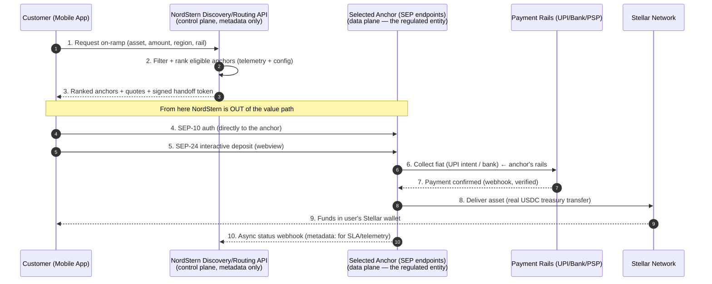

The mobile app is a **thin SEP wallet client + discovery client**. Money moves
**wallet ⇄ anchor** over standard SEPs. NordStern only ever sees **metadata**
(request, ranking, status webhooks) for routing, SLAs, billing, and network
telemetry. This is also *better product*: the telemetry moat (ground-truth
health/fill/fee data because we run the anchors) is exactly what the vision doc
identifies as the durable advantage, and we get it **without** custody.

**Off-ramp later, no re-architecture:** the same control/data split holds. Off-ramp
adds capabilities to the *anchor's* data plane (SEP-24 withdraw, PSP payout, treasury
draw-down) and adds `offramp` as a routable capability in discovery. The control and
discovery planes are unchanged. This is why we model **capabilities, not SEPs**
(§0.4).

### 0.4 Model capabilities, not SEPs

Per `nordstern-platform-vision`, the domain is modeled as **capabilities**
(`issue`, `on-ramp`, `off-ramp`, `quote`, `kyc`, `settle`, `custody`) rather than
SEP endpoints. Stellar/SEP is *one adapter* behind those capabilities. This keeps
the door open to XRPL/EVM later and — critically for this document — means the
routing engine, discovery registry, and admin config all speak "capabilities,"
so adding off-ramp or a new chain is additive, not a rewrite.

### 0.5 Design tenets (the through-line for every §)

1. **Control plane never touches funds.** If a design puts NordStern on the value
   path, it's wrong.
2. **Isolation over multitenancy**, but *tiered and cell-bounded* — not naïve
   "one AWS account per anchor" (§5 explains why pure per-account doesn't scale).
3. **Everything external is a swappable adapter** (KYC, deposit, payout, bank,
   liquidity) with a mock default. Already true in `business-server/src/adapters/`.
4. **Money moves are async, idempotent, status-driven.** Match by memo; never
   blind-retry a transfer on 5xx. (Already a codebase invariant.)
5. **Sandbox/testnet is the default; going live is a gated config swap**, never a
   code change.
6. **GitOps + IaC**: clusters and anchor stacks are cattle, fully reproducible —
   this is what makes DR, onboarding automation, and audit tractable.

---

## 1. Corrected high-level system architecture

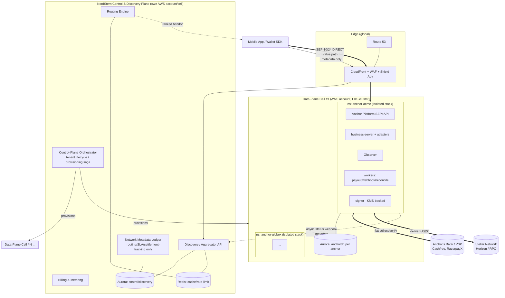

**Reading the diagram:** thin lines = metadata/control; **thick lines (==) = money /
value path**, and every thick line is **wallet ⇄ anchor ⇄ rails/Stellar** — never
through the NordStern control plane. The orchestrator provisions cells and anchor
stacks; discovery ingests only async metadata.

---

## 2. AWS infrastructure

### 2.1 Compute platform: EKS, not ECS/plain-EC2

| Option | Verdict | Why |
|---|---|---|
| **EKS** | ✅ **Chosen** | Rich tenant-isolation primitives (namespaces, NetworkPolicy, PSA, admission control), huge operator ecosystem (cert-manager, external-secrets, external-dns, Karpenter, KEDA, ArgoCD), portability (a regulated anchor may demand on-prem/other-cloud — k8s is the escape hatch), first-class GitOps. |
| ECS/Fargate | ❌ Base platform | Simpler ops, but weak multi-tenant isolation story, AWS lock-in, no NetworkPolicy/admission ecosystem, poor fit for per-tenant policy. Fine for a couple of NordStern *internal* stateless services, not for the fleet. |
| Plain EC2 / ASG | ❌ | Re-implements orchestration by hand. Only appears *under* EKS as node capacity. |

**Node strategy — Karpenter, with a thin managed baseline:**

| Layer | Choice | Rationale |
|---|---|---|
| System/critical baseline | Small **EKS Managed Node Group** (or **EKS Auto Mode**) | Runs Karpenter itself, CoreDNS, CNI, observability agents — must exist before Karpenter can provision. On-demand, spread across 3 AZs. |
| Tenant workloads | **Karpenter** NodePools | Just-in-time provisioning, bin-packing, consolidation (huge cost lever at 1000 anchors), per-tier/per-tenant NodePools via labels+taints, Graviton (ARM64) + Spot for stateless workers. |
| Selected untrusted/isolation-critical | **Fargate** *(selective)* | Per-pod VM isolation with zero node management — worth it for a hostile-tenant or build workload. But no DaemonSets, higher $/vCPU, slower cold start → **not** the default. |

Cluster Autoscaler + fixed Managed Node Groups is explicitly **rejected** for the
tenant tier: it can't bin-pack across heterogeneous per-tenant constraints or
consolidate aggressively, both of which are decisive economics at fleet scale.
Node OS = **Bottlerocket** (minimal, immutable, image-based → smaller attack
surface, faster patching) for the money-path fleet.

### 2.2 Account & region topology (cell-based, via AWS Organizations)

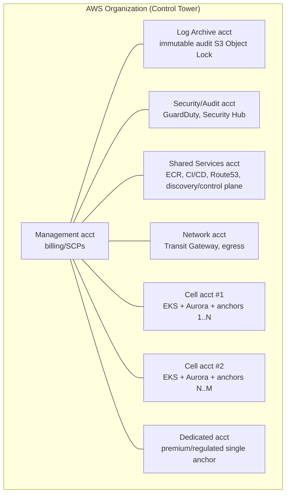

- **A "cell" = one AWS account containing one regional EKS cluster hosting a bounded
  number of anchors** (target 25–50; blast-radius cap). Scale the fleet by adding
  cells, not by growing a mega-cluster (§14).
- **Region:** India data-residency (DPDP Act 2023) pins the money-path to
  **ap-south-1 (Mumbai)** with **ap-south-2 (Hyderabad)** for DR. This is a
  compliance constraint, not a preference (§17).
- **Control Tower + Account Factory** vend cell accounts from a template; **SCPs**
  enforce guardrails (region lock, no public S3, mandatory encryption, deny
  root/console for money accounts).

### 2.3 Per-cell VPC & subnet design

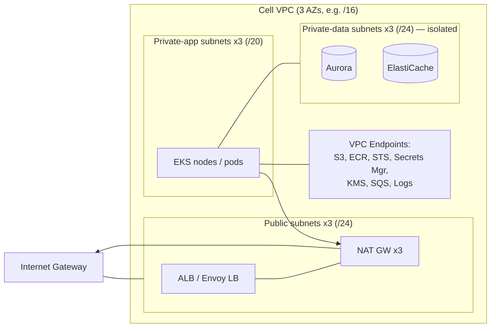

| Tier | Route | Purpose |
|---|---|---|
| **Public** (3× /24) | IGW | Only the load balancers + NAT gateways. Nothing else public. |
| **Private-app** (3× /20) | NAT egress + VPC endpoints | EKS nodes/pods. Egress to Stellar/PSP/bank via NAT (allowlisted EIPs); AWS APIs via **VPC endpoints** (cost + keeps traffic off the internet). |
| **Private-data** (3× /24) | No internet route | Aurora, ElastiCache. Reachable only from app-tier SGs. |
| **NAT** | 3× (one per AZ) | HA egress; EIPs are the **allowlist identity** banks/PSPs pin to (see §14 for the EIP-scaling caveat → egress gateway). |

**Security Groups:** default-deny; app-SG → data-SG on 5432/6379 only; LB-SG → app
node ports; SG-per-pod (VPC CNI security groups) for money-path pods that need
their own egress identity. **No 0.0.0.0/0 ingress** except the edge LB.

### 2.4 Data stores

| Store | Service | Isolation & rationale |
|---|---|---|
| Anchor tx state (`anchordb`) + business data | **Aurora PostgreSQL** | The AP owns tx state in Postgres. **Per-anchor database + role + per-tenant KMS CMK**; Aurora Serverless v2 (scales ACU down for idle small anchors — key economics) in a **per-cell** cluster for standard tier, **dedicated Aurora cluster** for premium/regulated tier. **RDS Proxy / PgBouncer** in front (connection multiplexing — Postgres conn limits are a real fleet bottleneck, §14). |
| Control/discovery data | Aurora PostgreSQL (Shared Services acct) | Registry, tenant metadata, routing config, network metadata ledger, billing. |
| Cache / ephemeral | **ElastiCache Redis** | SEP-10 challenge nonces, idempotency keys, rate-limit counters, quote cache, session. Per-cell (namespaced keys) standard; dedicated for premium. |
| Objects / backups / logs | **S3** | Static console assets, Loki chunks, Aurora snapshots export, **audit archive with Object Lock (WORM)**, Athena for audit queries. Lifecycle → Glacier. |
| Images | **ECR** | Immutable tags + **scan-on-push** + **cosign signature** verified at admission. Per-env repos. |

**Aurora over plain RDS:** storage auto-scaling, faster failover, Serverless v2 for
idle-scaling economics, cross-region replicas for DR. **DynamoDB** is used only for
NordStern-internal high-throughput metadata (idempotency, routing telemetry
counters) where its scaling beats relational — not for money-of-record.

### 2.5 Eventing & async — right tool per job (not "Kafka everywhere")

| Need | Choice | Why not the others |
|---|---|---|
| Cross-service choreography (onboarding saga, status fan-out) | **EventBridge** | Serverless, schema registry, no cluster to run. |
| Durable work queues (payout jobs, webhook delivery, reconciliation) | **SQS** (+ DLQ) | At-least-once + visibility timeout = perfect for idempotent money jobs; drives **KEDA** worker autoscaling incl. scale-to-zero. |
| Onboarding/provisioning workflow | **Step Functions** *(or Temporal)* | Long-running, human-approval gates, retries, audit trail — a saga, not a queue. |
| High-throughput AP event stream (multi-consumer, replay) | **MSK (Kafka)** — *only when justified* | The AP can emit tx events to Kafka. Adopt **per-cell** MSK only when event volume/replay needs exceed EventBridge+SQS. Don't pay for Kafka on day one. |

**Decision:** default to **EventBridge + SQS + Step Functions**; introduce MSK
lazily. This is cheaper, less to operate, and sufficient until high fleet volume.

### 2.6 Edge, DNS, TLS, LB

| Concern | Service | Notes |
|---|---|---|
| DNS | **Route 53** | Hosted zone for `*.nordstern.io`; health checks + latency/failover routing; **external-dns** auto-creates per-anchor records. |
| CDN / DDoS absorb | **CloudFront** | Fronts console static assets + SEP-1 `stellar.toml` (cacheable); absorbs volumetric DDoS; WAF at edge. |
| Certs (NordStern domains) | **ACM** | Wildcard `*.anchors.nordstern.io` via DNS-01. |
| Certs (custom anchor domains) | **cert-manager + ACME** | `payments.anchorco.com` → automatic issue/renew (§4). |
| Ingress data path | **ALB via AWS LB Controller** *(or NLB→Envoy)* | ALB = L7 host/path routing + WAF + OIDC; **NLB** where mTLS passthrough / static IP / lowest latency needed. See §4 for Gateway-API vs Ingress. |
| WAF | **AWS WAF** | Managed rule sets + rate-based rules + per-tenant custom rules; on CloudFront + ALB. |
| DDoS | **Shield Advanced** | Non-negotiable for a money platform; DDoS Response Team + cost protection. |

### 2.7 Observability stack

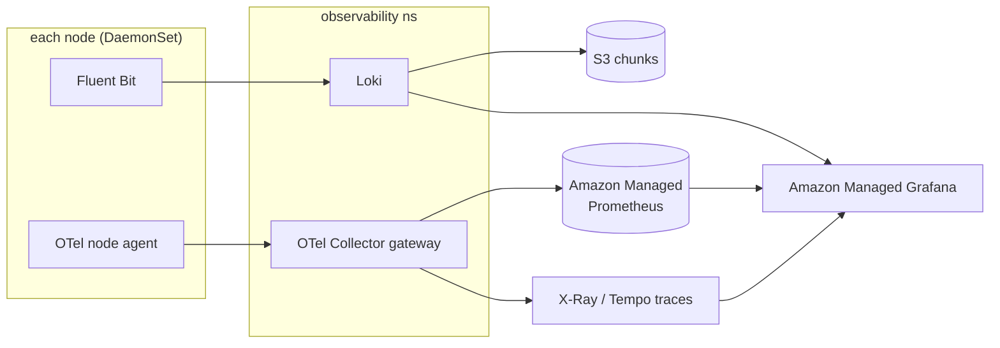

- **Metrics:** Prometheus scrape → **Amazon Managed Prometheus (AMP)**; dashboards in
  **Amazon Managed Grafana (AMG)**. Per-tenant metrics via `tenant_id` label — but
  **watch cardinality** (a 1000-anchor fleet can explode series count; use recording
  rules + label discipline, §14).
- **Logs:** **Fluent Bit DaemonSet** → **Loki** (S3-backed) with per-tenant streams;
  financial/audit logs forked to **immutable S3 (Object Lock)** in the Log Archive
  account. Not per-pod sidecars (cost, §6).
- **Traces:** **OpenTelemetry** — node agent + gateway collector → X-Ray/Tempo.
  End-to-end trace from discovery request → anchor SEP → Stellar submit is gold for
  debugging money flows.
- **Synthetics:** per-anchor SEP-1/10/24 health probes feed both alerting **and** the
  discovery-plane uptime score (§10). Ground-truth health = the moat.

**Sidecar vs DaemonSet vs gateway trade-off:** at 1000 anchors, per-pod OTel/Fluent
Bit sidecars would add thousands of containers and their memory floors. **DaemonSet
(one per node) + a gateway collector** is dramatically cheaper and is the chosen
pattern.

---

## 3. Kubernetes architecture

### 3.1 Cluster topology (one cell)

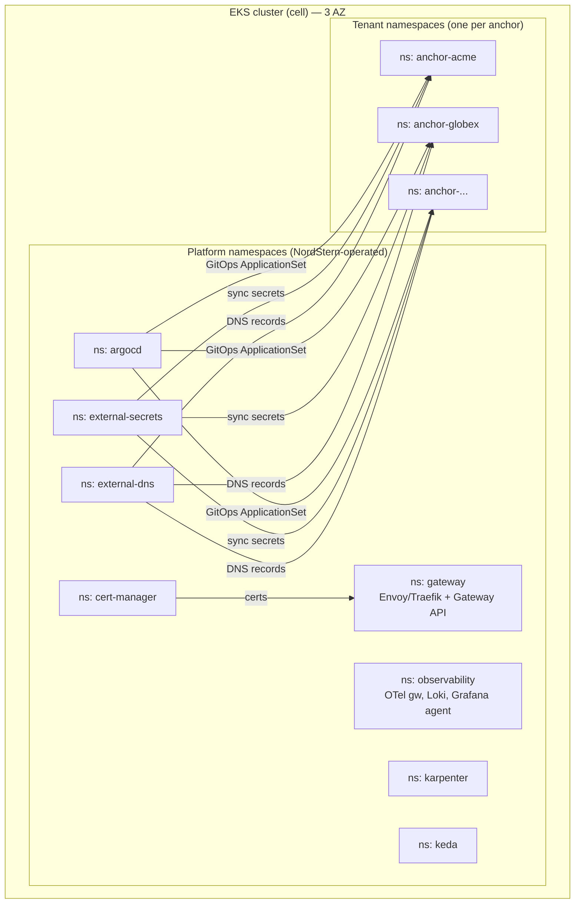

### 3.2 Namespaces

- **Namespace per anchor** (`anchor-<slug>`) is the primary logical boundary: scopes
  RBAC, NetworkPolicy, ResourceQuota, LimitRange, ServiceAccounts, secrets.
- **Platform namespaces** for shared operators (gateway, cert-manager,
  external-secrets, external-dns, argocd, karpenter, keda, observability).
- **Pod Security Admission = `restricted`** on all tenant namespaces (enforced).
- **ResourceQuota + LimitRange per tenant ns** → prevents a noisy/hostile tenant from
  starving the cell; default requests/limits injected.

### 3.3 Workloads per anchor (Deployments, not one mega-pod)

| Workload | Kind | Replicas / scaling | Notes |
|---|---|---|---|
| `business-server` | Deployment | HPA 2→N (CPU + p95 latency) | Callbacks, SEP-24 interactive UI, adapters. Stateless. |
| `anchor-platform` (SEP + Platform API, `-s -p`) | Deployment | HPA 2→N | Stateless; state in Aurora. |
| `observer` (AP `-o`) | Deployment | **replicas=1 + leader-election, PDB minAvailable=1** | **Single-writer**: watches the ledger; two observers = double-processing risk. `Guaranteed` QoS + high PriorityClass. |
| `worker-payout` / `worker-webhook` / `worker-reconcile` | Deployment | **KEDA** on SQS depth, **scale-to-zero** | Idempotent SQS consumers; Spot-eligible. Scale-to-zero is a big idle-cost win. |
| `signer` | Deployment | 2 (HA) | **Isolated Stellar signing service**, KMS-wrapped seed, own SA + NetworkPolicy, minimal surface. Business-server calls it; **plaintext seeds never live in the app pod** (§13). |

**No StatefulSets in the app tier** — databases are Aurora (managed), caches are
ElastiCache. StatefulSets would only appear if we self-hosted stateful infra
(we don't; that's a deliberate managed-service choice).

**DaemonSets (platform):** Fluent Bit, OTel node agent, node-problem-detector, CNI.

### 3.4 Autoscaling — three independent loops

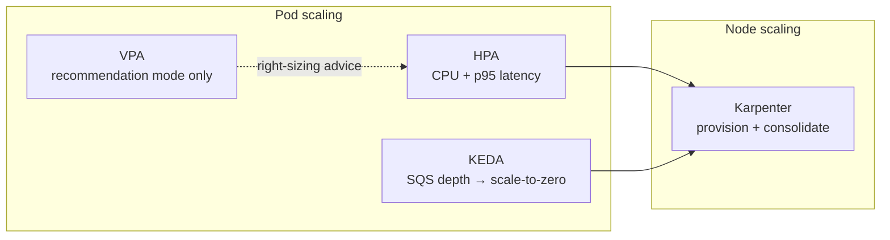

- **HPA** for request-driven services (business-server, AP SEP). Custom metrics
  (p95 latency, RPS) via Prometheus Adapter, not just CPU.
- **KEDA** for event-driven workers → **scale-to-zero** idle anchors. This is the
  economics unlock at 1000 anchors (§16).
- **VPA in *recommendation* mode** only (right-sizing input) — never in-place
  alongside HPA on the same metric (they fight).
- **Karpenter** provisions/consolidates nodes; NodePools per tier with taints.
- **Cluster-proportional-autoscaler** for CoreDNS (DNS becomes a bottleneck as pod
  count grows, §14).

### 3.5 Scheduling, resilience, health

- **Taints/tolerations:** tenant NodePools tainted `tenant-tier=standard|premium`;
  premium/dedicated anchors get their own tainted pool.
- **podAntiAffinity + topologySpreadConstraints:** spread replicas across AZs/nodes
  (no single-node/single-AZ money service).
- **PodDisruptionBudgets:** `minAvailable` for observer (1) and money-path services
  so drains/upgrades never fully evict them.
- **PriorityClasses:** `observer`/`signer`/`business-server` > workers > batch.
- **Probes:** `startupProbe` (slow AP boot) → `readinessProbe` (gate traffic) →
  `livenessProbe` (restart hung). Readiness must check DB + Platform API reachability
  for the money path.
- **Rolling updates:** `maxUnavailable=0, maxSurge=1` for money-path (never dip below
  capacity); progressive delivery (Argo Rollouts canary) for business-server.
- **Resources:** money-path pods = **`Guaranteed` QoS** (requests==limits); workers =
  `Burstable`. Memory limits sized to avoid OOM on the observer especially.

### 3.6 Admission policy (Kyverno / OPA Gatekeeper)

Enforced cluster-wide: images only from our ECR + **cosign-verified**; no `:latest`;
no privileged / hostPath / hostNetwork; requests+limits required; `tenant_id` label
required; read-only rootfs + drop-all-caps; ServiceAccount must be IRSA-scoped.
Admission failures block deploy — this is a compliance control, not a nicety.

---

## 4. Ingress / reverse proxy

### 4.1 Requirements

Automatic: per-anchor subdomain **and** custom domain (`payments.anchorco.com`),
TLS issue + renew, DNS record creation, ingress/route creation, SNI routing — all
**programmatically**, on onboarding, with zero human touch. This is the "Vercel for
domains" experience.

### 4.2 Comparison

| Option | Dynamic config | ACME/TLS | Custom domains at scale | Multi-tenant model | Verdict |
|---|---|---|---|---|---|
| **NGINX Ingress** | Reload-based; annotation sprawl; large-config reloads hurt at fleet scale | via cert-manager | OK | Weak (annotations) | ⚠️ Works, but reload model + the community controller's uncertain long-term future are strikes. |
| **Traefik** | ✅ Native CRDs, hot reload, built-in ACME | ✅ Built-in | ✅ Good | Good (IngressRoute CRD) | ✅ **Best pragmatic v1** — fastest path to auto-TLS + dynamic. |
| **Gateway API** (impl: **Envoy Gateway** / Cilium) | ✅ Declarative, role-oriented | via cert-manager | ✅ Excellent | ✅ **Best model**: platform owns `Gateway`, tenant owns `HTTPRoute` | ✅ **Best strategic target** — the future-proof, RBAC-clean standard. |
| **Istio ingress** | ✅ | via cert-manager | ✅ | ✅ but heavy | ⚠️ Only if you're already running the full mesh; otherwise operational overkill. |
| **Envoy (raw)** | ✅ powerful | manual | manual | build-it-yourself | ❌ Too low-level alone; use via Envoy Gateway. |

### 4.3 Recommendation

**Target: Gateway API implemented by Envoy Gateway (or Cilium Gateway).** It gives a
clean **role separation** that maps exactly onto our tenancy: NordStern platform team
owns the `Gateway` (listeners, TLS, WAF); the onboarding orchestrator creates a
tenant-scoped `HTTPRoute` per anchor. **Pragmatic v1: Traefik** (built-in ACME +
dynamic CRDs ships the "automatic everything" experience fastest); migrate to Gateway
API as the fleet and team mature. Pair either with:

- **cert-manager** — ACME issuance; **DNS-01 via Route 53** for wildcards, **HTTP-01
  or DNS-01** for custom domains; auto-renew.
- **external-dns** — auto-creates Route 53 records from Gateway/HTTPRoute/Service.

### 4.4 Automatic custom-domain onboarding flow

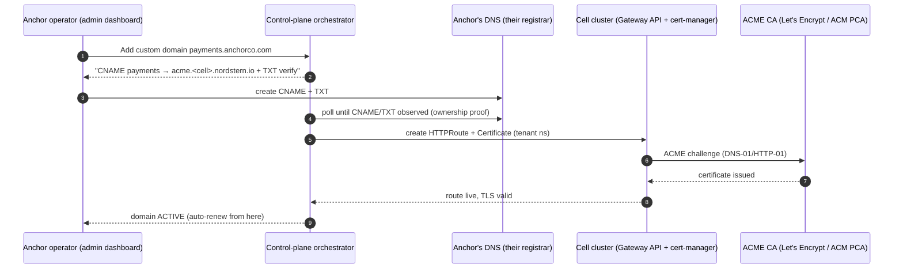

**Rate-limit caveat (see §14):** Let's Encrypt has issuance rate limits that bite at
hundreds of domains. Mitigate with **wildcard certs for `*.anchors.nordstern.io`**
(covers all subdomain-based anchors with one cert) and **ACM Private CA** or a
managed high-limit ACME for the custom-domain long tail.

---

## 5. Tenant isolation model

The brief asks: Namespace vs Node Pool vs Cluster vs AWS Account? The honest answer
is **none of them alone — a tiered, cell-bounded combination.**

### 5.1 The four levers compared

| Dimension | A. Namespace | B. Node pool | C. Cluster | D. AWS Account |
|---|---|---|---|---|
| **Security isolation** | Logical (RBAC, NetPol, PSA) | + compute isolation (no shared kernel across tenants) | + control-plane isolation | + IAM/blast-radius/billing hard wall |
| **Cost** | 💚 lowest (shared everything) | 🟡 nodes not shared | 🔴 ~$73/mo control plane + min nodes **each** | 🔴🔴 account overhead + all of C |
| **Scaling to 1000** | 💚 trivial | 💚 fine | 🔴 1000 control planes = ops/quotas nightmare | 🔴🔴 account sprawl, quota limits, vending load |
| **Maintenance** | 💚 one cluster to patch | 💚 | 🔴 1000 clusters to upgrade | 🔴🔴 |
| **Compliance/audit boundary** | 🟡 soft | 🟡 | 💚 clean | 💚💚 cleanest (separate CloudTrail, separate everything) |
| **Blast radius** | 🔴 shared cluster fate | 🟡 | 💚 contained | 💚💚 fully contained |

Pure **D (account-per-anchor)** is the compliance dream but **operationally
impossible at 1000** (account quotas, 1000 EKS control planes, vending throughput,
cost). Pure **A (namespace-only)** is too weak a boundary for money + audit +
blast-radius on its own.

### 5.2 Recommendation: **tiered cell architecture**

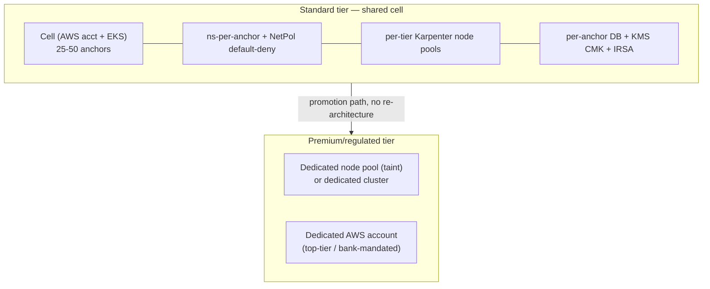

- **Baseline (every anchor):** **namespace-per-anchor** + default-deny NetworkPolicy
  + ResourceQuota + **its own full stack** (own AP, business-server, DB, keys,
  secrets, IRSA role, KMS CMK). This is the "physical isolation of the stack" the
  team already chose — realized *inside a shared, capped cell*.
- **Cell = blast-radius unit:** an AWS account + EKS cluster holding ≤ ~50 anchors.
  A cell failure/compromise is capped at those anchors, not the fleet.
- **Compute isolation (opt-in / by tier):** Karpenter **NodePool per tenant tier**;
  a high-value anchor gets its own tainted node pool (no shared kernel with others);
  **gVisor/Kata** or Fargate for hostile/untrusted workloads.
- **Premium/regulated tier:** promote to a **dedicated cluster** and/or **dedicated
  AWS account** — offered as a paid isolation SKU, and **required** where a banking
  partner mandates a hard account boundary. Because everything is GitOps/IaC,
  promotion is a config change, not a rewrite.

**Why this is right for NordStern specifically:** it matches the stated
"isolation-over-multitenancy, pay-more-for-isolation" philosophy *and* the "physical
isolation per anchor" decision, while staying operable at 1000 anchors, and it turns
isolation into a **monetizable tier** (dedicated account = premium price that covers
its own fixed cost, §16).

---

## 6. Pod / container architecture

### 6.1 Principle: a pod is a scaling+failure unit — don't build a mega-pod

Co-locate containers in one pod **only** when they must share lifecycle/network/volume
and scale 1:1 (a true sidecar). Everything with an independent scaling profile,
failure domain, or security boundary is a **separate Deployment**.

### 6.2 Per-anchor layout

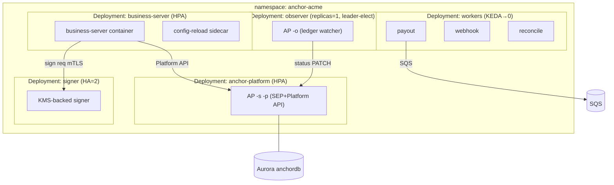

**Why each is separate:**

| Concern | Own Deployment because… |
|---|---|
| business-server | Request-driven, HPA on latency; frequent deploys. |
| anchor-platform SEP | Different scaling curve + slow boot; upstream image, upgraded on its own cadence. |
| **observer** | **Must be a singleton** (single-writer). Co-locating it with a scaled service would either break scaling or risk double-processing. |
| workers | Event-driven, scale-to-zero, Spot-eligible — a totally different resource/cost profile. |
| **signer** | **Security boundary.** Isolating the signing key in its own pod with its own SA/NetworkPolicy limits blast radius if business-server is compromised. |

### 6.3 Sidecars — deliberately minimal

| Candidate | Decision |
|---|---|
| Fluent Bit | **DaemonSet, not sidecar** (fleet cost). |
| OTel collector | **Node DaemonSet + gateway, not per-pod sidecar** (fleet cost). |
| Envoy proxy | **Only if service mesh** (Istio/Cilium injects it). Otherwise none. |
| config-reload | ✅ acceptable sidecar (tight lifecycle coupling). |
| DB proxy (RDS Proxy is managed) | Prefer managed RDS Proxy over a per-pod proxy sidecar. |

**Net:** the money-path pods stay lean (1 app container + at most a config-reload
helper). Cross-cutting concerns are node-level, which is the only way the sidecar
math works across thousands of pods.

---

## 7. Networking

### 7.1 East-west: default-deny + explicit allow (per namespace)

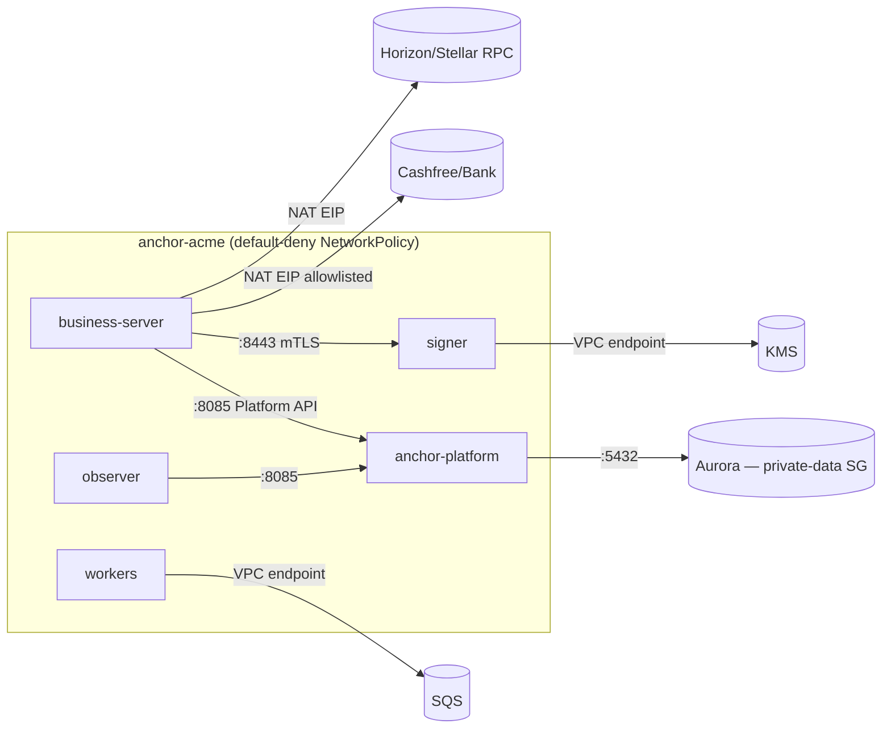

- **CNI: Cilium** (recommended) — identity-based policy, **L7-aware** NetworkPolicy,
  eBPF performance, Hubble observability, native Gateway API. Alternative: **AWS VPC
  CNI + security-groups-per-pod** (tighter AWS-native SG integration for money-path
  egress identity). Both are defensible; Cilium wins on policy expressiveness at
  fleet scale.
- **Default-deny per tenant namespace**, then explicit allows:
  business-server→AP(8085), business-server→signer(mTLS), observer→AP,
  AP→Aurora(5432), workers→SQS(via VPC endpoint). **No cross-namespace tenant
  traffic** — anchors cannot see each other.

### 7.2 The value path never traverses NordStern

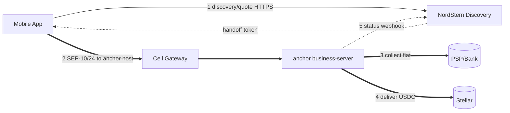

Only steps 1 and 5 touch NordStern, and both are **metadata**. Steps 2–4 (the money)
are wallet⇄anchor⇄rails.

### 7.3 Per-tenant egress identity (bank/PSP allowlisting)

Banks and PSPs IP-allowlist their partners. Each anchor needs a **stable, attributable
egress IP**. Options: NAT EIP per cell (simplest) → but banks may want per-anchor IPs.
At fleet scale, EIP-per-anchor hits AWS EIP quotas (§14) → use a **dedicated egress
gateway (per-tenant static IP via a small egress proxy fleet or Istio egress
gateway)**, or promote allowlist-sensitive anchors to a dedicated account with its own
EIPs. This is a known scaling seam, flagged in §14.

### 7.4 mTLS

Service-to-service mTLS (Cilium/Istio mesh **or** app-level via cert-manager-issued
certs) inside each namespace, mandatory on the business-server→signer hop. External:
TLS 1.2+ everywhere; SEP-10 JWTs authenticate wallets to anchors; OIDC + mTLS for
NordStern's internal service-to-service and workforce access.

---

## 8. Anchor lifecycle & onboarding

Two parallel tracks with very different clocks: **business/compliance** (people +
regulators, *weeks*) and **technical provisioning** (automation, *minutes–hours*).
The moat is compressing the business track over time.

### 8.1 End-to-end lifecycle

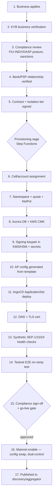

### 8.2 Realistic timelines (and the compression trajectory)

| Stage | Today (manual, early) | Mature (automated) | What compresses it |
|---|---|---|---|
| Business application + KYB | 3–7 days | hours | Automated KYB (GST/MCA/PAN APIs), reusable business identity |
| Compliance review (FIU/VDASP, sanctions) | 1–3 **weeks** | 2–4 days | Standardized checklist, in-house counsel, precedent library, our own FIU registration umbrella (if counsel approves) |
| Bank/PSP onboarding | 2–8 **weeks** (the real bottleneck) | days | **Pre-negotiated NordStern↔bank/PSP master relationships** — the biggest lever; anchors ride our rails instead of negotiating their own |
| Contract | days | minutes (click-through for standard tier) | Standard T&Cs per isolation tier |
| **Technical provisioning (steps 6–14)** | **hours** | **< 30 min, fully automated** | GitOps saga; already the fast part |
| Testnet E2E + health | hours | minutes | Automated synthetic suite |
| Go-live gate + mainnet | days (dual-control review) | hours | Automated gate checks + risk scoring, human only on exceptions |
| **Total** | **6–12 weeks** | **days** (bank rail permitting) | |

**Key insight:** the *technical* provisioning is already minutes; the durable
bottleneck is **banking + compliance**, which NordStern compresses by amortizing
**pre-built bank/PSP relationships and a compliance playbook** across all anchors —
the "aggregate the hard parts" thesis. This is also *not legal advice*: whether
NordStern can extend its own registrations/relationships to anchors is an **open
question for counsel** (§17).

### 8.3 Provisioning as a saga (idempotent, compensatable)

Provisioning runs as a **Step Functions state machine** (or Temporal workflow):
each step is idempotent with a compensating action (deprovision DB, revoke keys,
delete namespace) so a failed onboarding rolls back cleanly. IaC via **Crossplane
or Terraform** for AWS resources (account assignment, Aurora, KMS, EIP), **ArgoCD
ApplicationSet** for the in-cluster stack (namespace + workloads generated from a
Helm/Kustomize template parameterized per tenant). **Everything is data + Git** →
reproducible, auditable, DR-friendly.

---

## 9. NordStern internal services

### 9.1 Discovery / Aggregator (control plane — centralized, and it should be)

**Centralized: yes.** The network value *is* the aggregate view; a distributed
registry would defeat the purpose. Responsibilities: anchor registry & metadata,
capability catalog (`on-ramp`/`off-ramp`/`quote`/`kyc` per asset/region/rail),
health & availability (from synthetics + status webhooks), fee/spread comparison,
liquidity/limit headroom signals, region coverage, ranking, and the **SDK/API** that
wallets and the mobile app call.

- **Read-heavy, cache-first:** Aurora (source of truth) + **Redis** hot cache +
  CloudFront for cacheable discovery responses. Health/telemetry ingested async
  (EventBridge) so the read path is never blocked.
- **Never on the money path** (§0.3). It returns rankings + quotes + a **signed
  handoff token**; execution is wallet⇄anchor.

### 9.2 Payment ledger — the sharp compliance question

> Should there be a **centralized** NordStern payment ledger?

**Recommendation: NO central ledger of customer funds. Yes to a central *network
metadata* ledger.**

| Ledger | Where | Contents | Regulated? |
|---|---|---|---|
| **Book-of-record for customer money** | **Per anchor** (in its isolated stack; e.g. TigerBeetle per anchor) | Actual debits/credits of that anchor's fiat/USDC | **The anchor is the regulated entity** |
| **Network metadata ledger** | **NordStern (central)** | Which anchor served which *routed* request, status transitions (from webhooks), SLA/settlement-tracking, **billing/metering of NordStern's fees**, reconciliation of *our* invoices | NordStern as infra provider (no custody) |

A central ledger of customer balances would make NordStern the **book-of-record for
other people's money = custodian/money-transmitter** — the exact boundary we refuse
to cross. The central ledger tracks **the network and our billing**, not customer
balances. Double-entry accounting of customer funds lives **per anchor**.
**(Flag for counsel — §17.)**

### 9.3 KYC — shared or per-anchor?

> Should NordStern own KYC? Should KYC be shared ("verify once, use across
> anchors")?

- **Default: each anchor is the KYC data controller; NordStern is a processor/
  orchestrator.** NordStern provides a **`KycProvider` adapter framework** (Surepass
  today, HyperVerge/Signzy later) configured per anchor; **KYC data lives in the
  anchor's isolated DB**, not a central warehouse.
- **Shared/reusable KYC** ("verify once") is a compelling *future* product but
  **legally fraught** across independent regulated entities: DPDP Act consent &
  purpose-limitation, cross-entity data sharing, who's the controller, retention.
  Offer it **only** with explicit user consent + a legal structure counsel approves —
  never as silent default plumbing. `AGENTS.md` §3 explicitly parks the shared-KYC
  network. **(Flag for counsel — §17.)**

### 9.4 Transaction database — hybrid

**Per-anchor authoritative transaction DB** (in the isolated stack — the AP owns tx
state) **+ central NordStern metadata DB** (routing outcomes, network status,
billing). Not centralized (that re-imports custody + a single blast radius over all
anchors' money data), not purely per-anchor (we'd have no network view). Hybrid:
authoritative money data stays with the regulated anchor; NordStern holds only the
network/metadata slice it needs.

---

## 10. Routing engine

### 10.1 Three-stage pipeline

```mermaid
flowchart LR
    REQ[SDK request:<br/>asset, amount, region, rail, user] --> F[Stage 1: HARD FILTERS]
    F --> SC[Stage 2: SCORING]
    SC --> TB[Stage 3: TIE-BREAK + SHAPING]
    TB --> OUT[Ranked anchors + SEP-38 quotes<br/>+ signed handoff]

    subgraph F1["Filters (binary eligibility)"]
        f1[region/asset-pair supported]
        f2[rail supported e.g. UPI]
        f3[capacity/daily-limit headroom]
        f4[health = UP now]
        f5[KYC tier match]
        f6[compliance/sanctions eligible]
    end
    subgraph S1["Score (weighted, per-request tunable)"]
        s1[fee + FX spread]
        s2[settlement speed]
        s3[uptime/SLA + success rate]
        s4[liquidity headroom]
        s5[reputation]
        s6[latency + region proximity]
        s7[user preference/stickiness]
    end
    F --- F1
    SC --- S1
```

- **Stage 1 — hard filters:** binary eligibility (region, asset pair, rail, live
  health, KYC tier, daily-limit headroom, compliance eligibility). A failing anchor
  is removed, not penalized.
- **Stage 2 — weighted score:** fee/FX spread, settlement speed, uptime + real
  success rate, liquidity headroom, reputation, latency, user stickiness. Weights are
  **policy** (per-request tunable: "cheapest" vs "fastest"), explainable for audit —
  **rules first, ML later**.
- **Stage 3 — shaping & tie-break:** respect each anchor's rate limits (avoid
  thundering herd onto the cheapest), **sticky routing** so an in-flight user stays on
  one anchor, and **failover** to the next-best on failure.

### 10.2 Data sources — the moat

Ground-truth telemetry (**we run the anchors**: real health, fill rate, actual
realized fees), plus declared config from the admin dashboard (§11), plus real-time
signals (liquidity, queue depth). External (non-NordStern) anchors can be ingested
with lower-trust declared data. **Quotes** via **SEP-38** to top-K eligible anchors,
returning the best. Output is a **ranked list + handoff token** — NordStern does not
execute (§0.3).

---

## 11. Admin dashboard

What each anchor operator configures. All of it is **per-tenant data**, hot-reloaded
into the isolated stack, and the pricing/limit fields **feed the routing score**
(§10) — so config literally changes an anchor's competitiveness.

| Category | Controls |
|---|---|
| **Limits** | min/max deposit, per-user daily/monthly, aggregate daily cap, velocity limits |
| **Pricing** | fee % + fixed fee, **tiered pricing**, **FX spread/markup**, promotional rates, rate cards per corridor |
| **Rails** | supported banks, UPI on/off, card (if licensed), payout schedule/settlement delay |
| **Assets/corridors** | supported assets (USDC…), regional restrictions, operating hours |
| **Risk** | risk-scoring rules, auto-pause thresholds (error-rate, fraud, liquidity floor), allow/deny lists, step-up KYC by amount |
| **Treasury/liquidity** | reserve floor, liquidity limits, auto-pause when float low |
| **Ops** | maintenance mode, feature flags, sandbox↔live toggle (gated), webhook config, API-key issue/rotate, team RBAC (SoD) |
| **Reporting** | transaction exports, statements, reconciliation, settlement tracking, dispute/refund workflow |

**Beyond what we listed — what mature PSPs (Stripe/Razorpay) expose that we should
add:** sub-accounts/roles with SoD, dynamic/rule-based pricing, refund & dispute
handling, 3DS-equivalent step-up, campaign/discount codes, per-key scoped rate
limits, downloadable audit trail, and a full **sandbox** mirroring production.
**Guardrail:** anything that moves real money or goes live is **gated + dual-control**
(§7 go-live in `AGENTS.md`), never a casual toggle.

---

## 12. Mobile app (on-ramp only)

### 12.1 What it is

A **SEP-compatible wallet client + NordStern discovery client** — deliberately *not* a
custodial wallet (per `AGENTS.md` §1: we don't custody keys). The user's Stellar
address is either their own external wallet or a **non-custodial** in-app key in the
secure enclave. The app orchestrates discovery → hands off to the selected anchor's
SEP-24 interactive flow.

### 12.2 Screens & flow

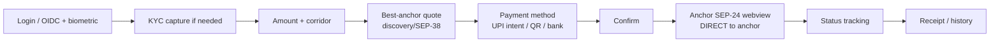

### 12.3 Communication, offline, security

- **Communication:** HTTPS + **OIDC** to NordStern discovery (quotes/routing,
  metadata only) with **certificate pinning**; then **SEP-10 auth + SEP-24
  interactive webview directly against the selected anchor**; `upi://pay` intent to
  the user's UPI app for fiat-in.
- **Transaction lifecycle:** mapped to SEP-24 statuses
  (`incomplete → pending_user_transfer_start → pending_anchor → completed/error`),
  surfaced as user-friendly states.
- **Offline:** read-only cache of history/quotes; **no money action initiated
  offline**; **idempotency keys** on every create; resume in-flight tx by polling on
  reconnect.
- **Push + background:** **FCM/APNs push-first** for status changes, with
  **BGTask/WorkManager** polling fallback + exponential backoff (never tight-poll).
- **Security:** no server secrets in the binary; secure storage (Keychain/Keystore);
  cert pinning; root/jailbreak detection; biometric app-lock; short-lived tokens.
  The app never holds NordStern platform credentials — only user-scoped tokens.

---

## 13. Security & threat model

| Threat | Primary controls |
|---|---|
| **DDoS** | Shield Advanced + CloudFront + WAF (managed + rate-based) + per-tenant quotas + Karpenter surge; discovery is cache-first so it absorbs load. |
| **Compromised anchor** | Cell/namespace/account isolation caps blast radius; default-deny NetworkPolicy (no lateral movement); per-tenant creds/KMS/DB; egress control; isolate-and-revoke runbook; no shared secrets. |
| **Compromised API key** | Short-lived, **scoped** keys; OIDC + mTLS for internal; per-key rate limits; anomaly detection; instant revoke; keys never grant money-movement on NordStern side (we can't move money). |
| **Leaked secret** | Secrets Manager + **per-tenant KMS CMK**; automated rotation; **no plaintext seeds in pods** (isolated signer); git-secret scanning; short TTL; CloudTrail detection. |
| **Insider** | Least-privilege IAM + IRSA; **dual-control** for mainnet-enable and any money-adjacent op; break-glass with alerting; SoD in dashboard RBAC; full immutable audit. |
| **Container escape** | PSA `restricted`, seccomp, drop-all-caps, read-only rootfs, no privileged/hostPath; **Bottlerocket**; **gVisor/Kata or Fargate** for untrusted; per-tenant node pools remove shared-kernel exposure for premium. |
| **Supply chain** | **cosign image signing** verified at admission; SBOM; ECR-only + scan-on-push; **pin digests**; dependency scanning; SLSA provenance in CI. |
| **Secret rotation** | Automated via Secrets Manager + External Secrets Operator; per-tenant KMS; rotation runbooks for Stellar keys (testnet quarterly reset already forces key hygiene). |
| **Audit logging** | Org-wide CloudTrail → Log Archive account; **S3 Object Lock (WORM)**; tamper-evident, per-tenant partitioned; queryable via Athena. |

**Crown jewels — Stellar signing keys:** KMS/HSM-backed, held only by the **isolated
signer** service (own SA, own NetworkPolicy, mTLS-only ingress), **dual-control for
mainnet**, never in the general app pod. Encryption: at-rest KMS per-tenant CMK; in
transit TLS 1.2+/mTLS; field-level encryption for PII. Identity: **IRSA** (one
least-priv role per workload), **OIDC** for workforce SSO, **RBAC** in k8s + app,
**NetworkPolicies** default-deny, **ServiceAccounts** never shared across tenants.

---

## 14. Scalability

### 14.1 Cell-based horizontal scaling

| Fleet size | Cells (≤50/cell) | AWS accounts | DB strategy | Notes |
|---|---|---|---|---|
| **10 anchors** | 1 cell | ~4 (mgmt/sec/shared/1 cell) | Per-cell Aurora, per-anchor DB | Trivial; scale-to-zero keeps idle cost near-zero. |
| **100 anchors** | 2–4 cells | ~7–9 | Aurora Serverless v2 per cell + RDS Proxy | Discovery starts to matter; cache hard. |
| **500 anchors** | ~10–20 cells | ~15–25 | Some dedicated Aurora for premium | Egress-IP & cert rate limits appear (below). |
| **1000 anchors** | ~20–40 cells | ~30–45 | Tiered: serverless standard / dedicated premium | Provisioning throughput + observability cardinality dominate. |

**Scale by adding cells, never by growing one cluster** — bounded blast radius +
bounded per-cluster limits.

### 14.2 Known bottlenecks & mitigations

| Bottleneck | Mitigation |
|---|---|
| EKS per-cluster node/pod limits | Cap anchors/cell; add cells. |
| Postgres connection limits (fleet of pods) | **RDS Proxy / PgBouncer**; connection pooling per service. |
| **EIP quota** for per-anchor egress allowlisting | **Egress gateway with shared/rotated static IPs**, or dedicated account for allowlist-sensitive anchors (§7.3). |
| **ACME/Let's Encrypt issuance rate limits** | **Wildcard cert** for `*.anchors.nordstern.io`; **ACM Private CA** for custom-domain long tail. |
| Observability **metric cardinality** (per-tenant labels × 1000) | Recording rules, label discipline, per-cell Prometheus, drop high-cardinality labels. |
| CoreDNS at high pod count | Cluster-proportional autoscaler; NodeLocal DNSCache. |
| GitOps app count (ArgoCD) | **ApplicationSet** + sharded ArgoCD per cell. |
| Secrets Manager/KMS API throttling | Cache via External Secrets refresh interval; per-cell KMS grants. |
| Provisioning throughput | Saga is idempotent + parallelizable; pre-warm cell capacity. |

### 14.3 Idle economics (the 1000-anchor unlock)

Most anchors in a long tail are **idle most of the time**. **KEDA scale-to-zero**
workers + **Aurora Serverless v2** low-ACU idle + **Karpenter consolidation** mean an
idle anchor costs cents, not a fixed node. This is what makes the long tail
profitable (§16).

---

## 15. Disaster recovery

| Layer | Strategy | RPO / RTO target |
|---|---|---|
| **Data (Aurora)** | Automated backups + **PITR**; cross-region snapshot copy to ap-south-2 | RPO ≤ 5 min / RTO ≤ 1 hr (tier-1) |
| **Cluster/namespace** | **GitOps = clusters are cattle**; Velero for namespace state/PVCs | RTO: rebuild a cell from Git in < 1 hr |
| **Signing keys** | KMS **multi-region keys**; key material never leaves KMS | No data loss; instant failover |
| **Region failover** | Active-passive per cell (tier-1 anchors active-active) | Route 53 health-check failover |
| **Idempotency safety** | Money moves are memo-matched, status-driven, idempotent → **no double-spend on replay/failover** | correctness under recovery |
| **Data residency** | DR region must satisfy India residency (ap-south-2) | compliance-bounded |

Because provisioning is IaC + GitOps and money moves are idempotent, DR is
**reconstruct-from-source**, not restore-a-snowflake. Regular **chaos/game-day**
drills (kill a cell, force a region failover) validate RTO. Runbooks per failure
mode; the money-path idempotency is what makes recovery *safe*, not just fast.

---

## 16. Cost optimization

| Lever | Impact |
|---|---|
| **KEDA scale-to-zero** idle anchors | Largest single lever at fleet scale — idle anchor ≈ cents. |
| **Aurora Serverless v2** | ACU scales to floor for idle DBs. |
| **Karpenter consolidation + Spot** (stateless workers only; on-demand for observer/signer/money-path) | 40–70% node savings on the burstable tier. |
| **Graviton (ARM64)** everywhere it runs | ~20% price/perf. |
| **VPC endpoints** vs NAT data-processing | Cuts NAT cost for AWS API traffic. |
| **S3 lifecycle** (logs → Glacier, expiry) | Cheap long-term audit retention. |
| **Tiered isolation as pricing** | Dedicated cluster/account is a **premium SKU priced to cover its fixed cost** — isolation becomes revenue, not just cost. |
| **Per-tenant cost allocation tags** | Compute true **cost-to-serve per anchor** → data-driven pricing + spot the unprofitable long tail. |
| **Savings Plans** for baseline (system nodes, discovery) | Commit-discount the always-on floor. |

The economic model: **shared cell + serverless + scale-to-zero** makes the standard
tier's long tail profitable; the **dedicated tier is priced to be self-funding.**
Every anchor gets a cost-to-serve number via allocation tags → pricing is grounded,
not guessed.

---

## 17. Compliance considerations

> *Not legal advice. These are engineering-facing framings of open questions that
> require qualified Indian fintech/regulatory counsel — mirror into
> `COMPLIANCE_OPEN_QUESTIONS.md`.*

- **The custody boundary is the whole design.** Keeping NordStern off the value path
  (§0.3) and out of a central customer-fund ledger (§9.2) is what (attempts to) keep
  NordStern a **non-custodial infra provider** rather than a regulated
  money-transmitter/VDASP. **Whether that holds legally is an open question.**
- **Each anchor as the regulated entity** (FIU-IND registration, PMLA reporting,
  VDA/VDASP classification): the isolation model gives each a clean audit/data
  boundary. **Open: whether NordStern's own registrations/bank relationships can be
  extended to anchors** (§8.2) — a major go-to-market lever *if* counsel permits.
- **Data residency — DPDP Act 2023:** money-path + PII pinned to India regions
  (ap-south-1/2). Cross-border corridors (INR↔USDC is cross-border/FX) trigger
  **FEMA/LRS** questions — flag before mainnet (already noted in the USDC pivot).
- **KYC controller/processor** (§9.3), **shared-KYC consent limits**, **right-to-
  erasure vs immutable audit ledger** tension (resolve via crypto-shredding /
  tokenization, but confirm with counsel).
- **PCI-DSS** scope *if* any anchor enables cards (UPI/bank transfer avoids most of
  it — a reason to prefer those rails first).
- **Banking-partner risk:** high-velocity, crypto-adjacent accounts get frozen
  without FIU registration — the pre-negotiated-rail strategy (§8.2) is also risk
  mitigation, contingent on counsel.

Isolation is chosen **partly for compliance**: separate CloudTrail/KMS/DB per
tenant/cell gives auditors a clean per-entity boundary.

---

## 18. Phased implementation roadmap

From today's single-anchor Compose MVP to the fleet platform above. **Do not skip
phases** (`AGENTS.md` §10) — each assumes the prior seams.

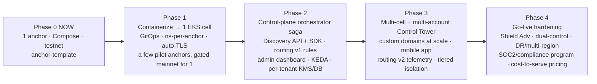

| Phase | Exit criteria |
|---|---|
| **0 (now)** | Single INR↔USDC anchor works end-to-end on testnet with mock/sandbox adapters (current state). |
| **1** | One EKS cell; anchor stack deployed via ArgoCD; namespace isolation + default-deny NetPol; cert-manager/external-dns auto-domain; observability live; 2–3 pilot anchors; **one** anchor on gated mainnet with dual-control. |
| **2** | Orchestrator provisions anchors via Step Functions saga; discovery API + wallet SDK; routing engine v1 (rules); admin dashboard on live config; KEDA scale-to-zero; per-tenant KMS + DB + isolated signer. |
| **3** | Multi-cell across ≥2 accounts (Control Tower); custom-domain onboarding at scale; mobile on-ramp app; telemetry-driven routing v2; premium dedicated-isolation tier; MSK only if event volume demands. |
| **4** | Shield Advanced, dual-control everywhere money moves, DR with tested RTO across regions, SOC2 + compliance program, chaos game-days, cost-to-serve-based pricing. |

---

## Appendix A — decisions summary (for the decision log)

| # | Decision | Rationale |
|---|---|---|
| 1 | NordStern stays **off the money-movement data path** (discovery/routing only) | Preserves non-custodial / not-an-anchor boundary; unlocks telemetry moat without custody. |
| 2 | **EKS** over ECS; **Karpenter** over Cluster Autoscaler | Isolation primitives, ecosystem, portability, bin-packing economics. |
| 3 | **Tiered cell-based isolation** (ns-per-anchor in a capped cell; premium → dedicated cluster/account) | Only model that satisfies isolation-first *and* operability at 1000 + monetizable tiers. |
| 4 | **Gateway API (Envoy) target; Traefik pragmatic v1** + cert-manager + external-dns | Automatic domain/TLS/DNS onboarding with clean tenant RBAC. |
| 5 | **No central customer-fund ledger**; per-anchor book-of-record + central *metadata* ledger | Keeps NordStern out of custody/money-transmission. |
| 6 | **Per-anchor KYC data (NordStern as processor)**; shared-KYC only with consent + counsel | DPDP/PMLA data-controller constraints. |
| 7 | **Isolated KMS-backed signer** service; no plaintext seeds in app pods; dual-control mainnet | Crown-jewel key protection + blast-radius. |
| 8 | **EventBridge + SQS + Step Functions** default; **MSK** only when justified | Right-sized async; avoid premature Kafka cost. |
| 9 | **KEDA scale-to-zero + Aurora Serverless v2 + Graviton/Spot** | Makes the long-tail anchor fleet profitable. |
| 10 | **GitOps + IaC saga** for provisioning | Onboarding automation, DR-as-rebuild, per-entity auditability. |

> **Open questions requiring counsel** (add to `COMPLIANCE_OPEN_QUESTIONS.md`):
> custody-boundary defensibility, extending NordStern registrations/bank rails to
> anchors, shared-KYC legality, FEMA/LRS on INR↔USDC, right-to-erasure vs immutable
> audit. Engineering must not resolve these in code.
