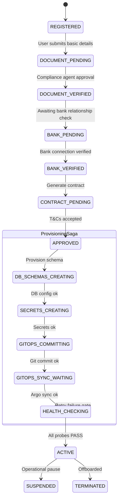

# NordStern — Multi-Tenant SaaS Orchestration & Aggregator Design

This design document outlines the target-state architecture of the NordStern Control Plane, Aggregator, and Cell Orchestrator. It incorporates the architectural refinements requested for scale (100+ anchors) to replace dynamic multi-database provisioning, ensure resumable deployments, enforce runtime boundaries, and decouple internal services.

---

## 1. High-Level Multi-Tenant Architecture

The system is separated into three distinct operational boundaries:
1. **The Management Boundary (Control Plane)**: Central orchestration, billing, business state, and tenant registration workflows.
2. **The GitOps Boundary (Infrastructure State)**: The declarative state of active workloads stored in Git and synchronized to EKS via ArgoCD.
3. **The Runtime Boundary (Cells)**: Isolated namespaces per anchor in Kubernetes, accessing private database schemas and KMS-encrypted secrets.

```mermaid
flowchart TB
    subgraph ControlPlane["Control & Discovery Plane (Shared AWS Account)"]
        API[Platform API Gateway] --> Orch[Onboarding Workflow Engine<br/>Temporal / Step Functions]
        Orch --> DB[Control Plane DB<br/>Business State & KYC Logs]
        Orch --> EvBus[Event Bus<br/>EventBridge / SQS]
        
        EvBus --> Proj[Provisioning Service]
        EvBus --> SecService[Secrets Service]
        EvBus --> GitOpsService[GitOps Git Committer]
        
        Agg[Aggregator Service] --> Routing[Routing Engine]
        Agg --> Cache[(Liquidity Cache)]
    end

    subgraph GitOps["GitOps Declarative State"]
        Repo[(Git Repository)]
    end

    subgraph Cell1["EKS Cell (ap-south-1)"]
        Argo[ArgoCD Controller]
        GW[Gateway API]
        
        subgraph Namespace1["ns: anchor-acme"]
            AP1[Anchor Platform]
            Biz1[business-server]
            Console1[Dashboard Client]
        end
        
        subgraph Namespace2["ns: anchor-globex"]
            AP2[Anchor Platform]
            Biz2[business-server]
            Console2[Dashboard Client]
        end
        
        Aurora[(Aurora PostgreSQL Cluster)]
    end

    %% Flow lines
    API Gateway -.-> Biz[Business Operator Dashboard]
    GitOpsService -->|1. Commit yaml config| Repo
    Repo -->|2. Pull manifests| Argo
    Argo -->|3. Reconcile state| Cell1
    Proj -->|4. Create isolated schema| Aurora
    SecService -->|5. Create Secret| AWSSecrets[AWS Secrets Manager]
    AWSSecrets -->|6. Sync secrets via ESO| Cell1
    GW -->|7. Route incoming HTTPRoute| Namespace1 & Namespace2
```

---

## 2. Refined Design Patterns

### 2.1 Schema-Based Database Isolation
Rather than provisioning a separate physical Postgres database per anchor (which fragments connection pools and spikes Aurora Serverless costs), we utilize **schema-based isolation** inside a shared cell-bounded Aurora cluster.

- **Storage Structure**: One logical database (`anchordb`) hosting multiple schemas:
  ```
  Aurora PostgreSQL Cluster
  └── DB: anchordb
      ├── Schema: anchor_acme
      ├── Schema: anchor_globex
      └── Schema: anchor_xyz
  ```
- **Permission Boundary**: Each tenant namespace operates with a unique EKS IAM Role (IRSA) mapping to a specific PostgreSQL role:
  - `acme_user` has access *only* to `anchor_acme` schema.
  - `globex_user` has access *only* to `anchor_globex` schema.
- **Benefits**: Provisioning a new schema is instantaneous (`CREATE SCHEMA` + `CREATE USER` + grants), and Postgres connection pooling via RDS Proxy behaves predictably.

### 2.2 Decoupled Control Plane Services
The control plane is split into single-responsibility microservices coordinating asynchronously:
- **Platform API**: Serves the onboarding UI, admin dashboard backend, and billing endpoints.
- **Workflow Engine**: Orchestrates the stateful provisioning saga.
- **Provisioning Service**: Abstracts database actions (runs the schema creation DDL and permissions).
- **Secrets Service**: Generates signing keypairs and stores them in AWS Secrets Manager.
- **GitOps Service**: Serializes tenant variables (replicas, custom domains, ResourceQuotas) into YAML and commits them to Git.
- **Notification Service**: Handles slack alerts, email triggers, and operational pages.

---

### 2.3 Resumable Onboarding Sagas (Workflow Engine)
Tenant onboarding is an asynchronous, multi-stage process subject to network or cloud provider failures. We utilize **Temporal** (or **AWS Step Functions**) to model onboarding as a stateful, resumable workflow:


If the Git commit fails or the network times out during EKS deployment, the workflow engines pauses, records the progress, and retries from the last successful checkpoint without duplicating DB or secret creations.

---

### 2.4 Strict Separation of Business State and Git State
Git is treated strictly as the **declarative state of Kubernetes infrastructure**. No runtime client PII, KYB verification documents, banking credentials, or KYC records touch Git.

| Store | Scope | Example Data |
|---|---|---|
| **Control Plane Database** | Business State (Operational) | Sanction check results, KYB approvals, billing logs, client email, contact details |
| **Git Repository** | Infrastructure State (Declarative) | Namespace name, domain name, CPU/Memory resource allocations, Helm value overrides |
| **AWS Secrets Manager** | Runtime Secrets (Sensitive) | API keys (Razorpay/Cashfree/DIDIT), database credentials, Stellar treasury seeds |

---

### 2.5 Gateway API for Kubernetes Ingress
We reject individual Kubernetes `Ingress` controllers per tenant, opting for the **Kubernetes Gateway API** standard implemented via **Envoy Gateway** or **Cilium**.

- **Platform Layer**: The Platform Operator provisions a single `Gateway` resource in the cluster that opens up listeners on ports `80` and `443` and handles the wildcard `*.nordstern.live` SSL certificate.
- **Tenant Layer**: When a new tenant is provisioned, the GitOps Service only deploys a lightweight `HTTPRoute` resource in the tenant's namespace. This attaches dynamically to the platform's shared Gateway:
  ```yaml
  apiVersion: gateway.networking.k8s.io/v1
  kind: HTTPRoute
  metadata:
    name: globex-routes
    namespace: anchor-globex
  spec:
    parentRefs:
      - name: shared-gateway
        namespace: gateway
    hostnames:
      - "globex.nordstern.live"
      - "api.globex.globex.nordstern.live"
      - "console.globex.nordstern.live"
    rules:
      - matches:
          - headers:
              - name: Host
                value: "globex.nordstern.live"
        backendRefs:
          - name: anchor-platform
            port: 8080
      # ... routes for API and Console
  ```
This decouples the global routing ingress setup from individual tenant namespace operations, avoiding massive Ingress resource sprawl and reload penalties.

---

### 2.6 The Internal Platform API
To ensure Cloud portability (e.g. if an enterprise anchor demands running on Google Cloud GKE or on-premise), components never make raw AWS SDK calls directly. Instead, they interact with an **Internal Platform API** layer:

```
Provisioning Workflow Engine
          │
          ▼
    [Platform API]
          │
      ┌───┴───────────────┐
      ▼                   ▼
[AWS Adapter]     [GCP Adapter] (Future)
      │                   │
  AWS Secrets       GCP Secret Manager
  RDS Aurora        Cloud Spanner
```
All infrastructure operations (`CreateTenant`, `ProvisionSchema`, `GenerateSigningKeys`) are implemented as swappable provider adapters behind this Platform API interface.

---

### 2.7 Production Aggregator Layer
NordStern’s business differentiator is the capability to routes client liquidity dynamically. We implement a dedicated **Aggregator Service** sitting in front of the tenant anchors:

```
         [Mobile App / SDK Client]
                     │
                     ▼
             [API Gateway Ingress]
                     │
                     ▼
          [NordStern Aggregator]
                     │
       ┌─────────────┼─────────────┐
       ▼             ▼             ▼
  [Routing]      [Health]       [Liquidity]
   Engine        Monitor         Tracker
       │             │             │
       └─────────────┼─────────────┘
                     ▼
           [Ranked Handoff Token]
                     │
                     ▼
       (Wallet connects to selected)
          [Anchor: globex.nordstern.live]
```
- **Routing Engine**: Dynamically calculates routing scores based on FX spreads, corridors, transaction speed, SLA success rates, and liquidity reserves.
- **Health Monitor**: Runs active background synthetic checks on all deployed anchors.
- **Liquidity Tracker**: Subscribes to treasury balance events, caching headroom variables to ensure we don't route transactions to an anchor with low float.
