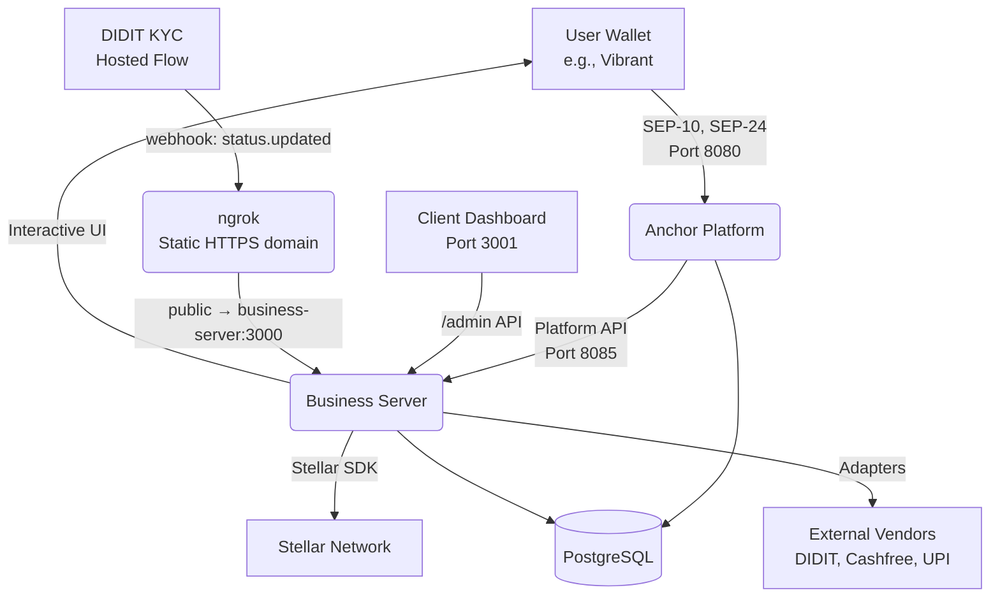
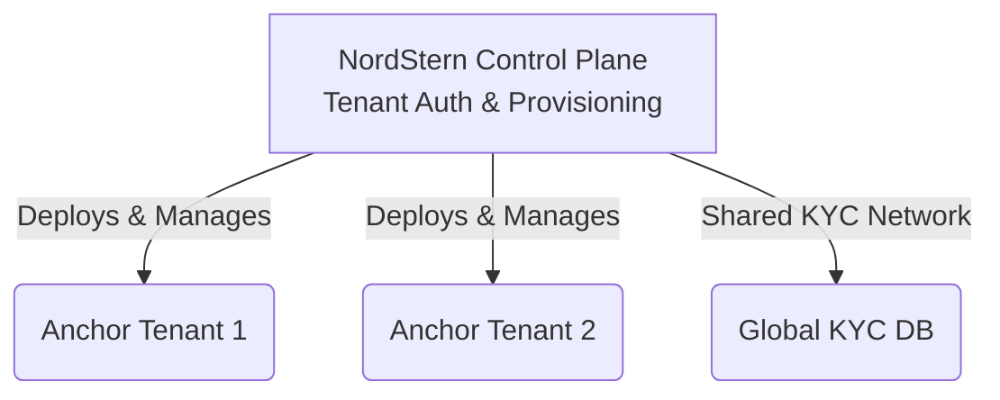

# Architecture

> **Context:** This document explains the technical architecture of the `anchor-template` stack, the flow of data, and the future multi-tenant vision.

## Current Architecture

The `anchor-template` stack runs in Docker Compose and consists of five main services:

### 1. `anchor-platform` (The Compliance Engine)
The official `stellar/anchor-platform:latest` Java application. 
- **Port 8080 (Public):** The SEP Server. Consumer wallets connect here to authenticate and request deposits/withdrawals.
- **Port 8085 (Private):** The Platform API. Used exclusively by our business server to fetch and update transaction states.
- It delegates all KYC (`/customer`) and FX (`/rate`) decisions to the business server.

### 2. `business-server` (The Core Logic)
A Node.js/Express TypeScript server running on **Port 3000**.
- **SEP-24 Interactive UI:** Serves the webview that pops up inside the user's wallet to collect KYC or show UPI payment instructions.
- **Stellar Ops:** Uses `@stellar/stellar-sdk` to execute on-chain transfers.
- **Vendor Webhooks:** Receives asynchronous callbacks from payment gateways (e.g., Razorpay) to advance transaction states.
- **Admin API:** Serves live ledger and metric data to the operator console.

### 3. `client` (The Operator Console)
A Next.js (App Router) React frontend running on **Port 3001**.
- The "Keel" visual design system.
- Provides the Anchor operator with live, polling views of their treasury, active users, KYC compliance, and a ledger of all deposits/withdrawals.

### 4. `db` (Database)
A PostgreSQL database running on **Port 5432**.
- Holds the `anchordb` schema used by the Anchor Platform to maintain transaction state.
- The business-server also uses it (schema `nordstern`) for the durable KYC store
  (`kyc_verifications`, `kyc_webhook_events`), keyed on the user's SEP-10 account.

### 5. `ngrok` (Public HTTPS Ingress — dev)
A Docker Compose service (`ngrok/ngrok`) that publishes `business-server:3000` on a
**reserved static domain** (`*.ngrok-free.dev`), set once in `PUBLIC_BASE_URL`. Inspector
at **Port 4040**.

**Why it exists:** the DIDIT KYC hosted flow is completed on the user's **phone** (a QR
scanned from the desktop wallet), and DIDIT reports the decision **server-to-server via a
webhook** — that webhook, *not* the browser redirect, is the **source of truth** for the
KYC gate. `localhost` cannot receive it, so a public HTTPS URL is required. Because the
domain is **reserved/static**, `PUBLIC_BASE_URL` and the DIDIT webhook registration stay
stable across restarts (previously an ephemeral ngrok URL had to be re-registered on every
boot). Making it a Compose service means the whole stack — including the tunnel — comes up
with a single `docker compose up`; no separate `ngrok` process to run by hand.

- Auth via `NGROK_AUTHTOKEN` in `.env`; the tunnel targets `business-server` over the
  Compose network, not the host.
- A reserved domain permits **one agent at a time** — stop any host `ngrok` (`pkill ngrok`)
  before `docker compose up`, or the container fails to bind the domain.
- The interactive webview polls `/sep24/kyc/status` every 3s and advances the moment the
  webhook lands, so the cross-device redirect never needs to return to the desktop session.
  (`PUBLIC_BASE_URL` is captured at container **create** time — recreate business-server
  after changing it, or a stale value leaks into the DIDIT session `callback` redirect.)

---

## Provider Adapters (The Seams)

Because the legal and banking model for every anchor might differ, the `business-server` uses a heavily abstracted "Seam" architecture.

> [!TIP]
> **Rule:** Never leak a vendor SDK (like Cashfree or HyperVerge) into the core SEP-24 flow. 

Everything is hidden behind interfaces located in `src/adapters/`:
- `KycProvider`: Responsible for identity verification.
- `DepositProvider`: Responsible for fiat collection (e.g., UPI intents).
- `PayoutProvider`: Responsible for fiat disbursement (e.g., Cashfree Payouts, RazorpayX).
- `RateProvider`: Responsible for live FX rates (e.g., USD to INR).

---

## Treasury Model

NordStern operates a **Dual-Treasury** design. We do *not* magically mint Circle USDC; we transfer it from a pre-funded pool.

1. **Fiat Treasury (Bank Account):** An Escrow/Nodal account holding INR.
2. **Crypto Treasury (Stellar Account):** A Stellar address pre-funded with 1:1 Circle USDC.

**Liquidity Balancing:** If users are constantly depositing fiat, the Fiat Treasury fills up, and the Crypto Treasury drains. The Anchor operator must periodically take the excess fiat, purchase bulk USDC, and refill the Crypto Treasury.

---

## Future Architecture (Control Plane)

Currently, `anchor-template` represents a **single** anchor. 
To scale NordStern into a SaaS platform, the architecture will evolve to include a **Control Plane**:

The Control Plane will:
1. Handle instant provisioning of new anchor tenants.
2. Manage shared infrastructure (K8s).
3. Potentially offer a "Verify Once, Use Anywhere" shared KYC network across all hosted anchors.
